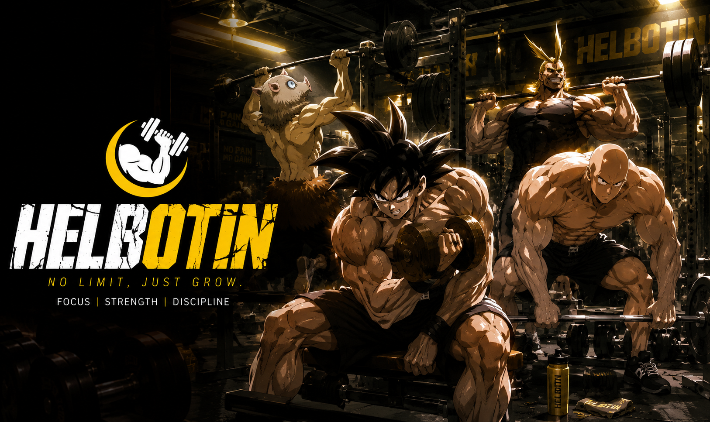

  <strong>Link</strong> : <a href="https://sk-camp.cloud">https://sk-camp.cloud</a>

---

## 프로젝트 소개

### 1. 프로젝트 소개

HELBOTIN은 **헬스 보이 루틴**이라는 의미를 가진 AI 운동 루틴 추천 서비스입니다. 운동 라이브러리, 개인 맞춤 운동 루틴 추천, AI 운동 챗봇을 통해 사용자가 더 쉽고 꾸준하게 운동을 이어갈 수 있도록 돕습니다.

### 2. 문제 정의

| 대상                  | 문제                                                   |
| --------------------- | ------------------------------------------------------ |
| 운동 경험자           | 반복되는 루틴으로 인한 정체기 및 흥미 저하             |
| 운동 초보자           | 어떤 운동을 어떻게 시작해야 할지 판단하기 어려움       |
| 통증/부상 이력 사용자 | 피해야 할 운동과 대체 운동을 구분하기 어려움           |
| 공통 사용자           | 운동 자세, 호흡, 주의사항 정보가 여러 곳에 흩어져 있음 |

### 3. 서비스 소개

| 핵심 기능           | 설명                                                                            |
| ------------------- | ------------------------------------------------------------------------------- |
| 운동 라이브러리     | 운동별 영상, 타겟 부위, 난이도, 기구, 자세 가이드를 제공합니다.                 |
| 개인 맞춤 루틴 추천 | 목표, 체력 수준, 통증 부위, 운동 요일과 시간에 맞는 주간 루틴을 생성합니다.     |
| AI 운동 챗봇        | 운동 자세, 주의사항, 대체 운동 질문에 RAG 기반으로 답변합니다.                  |
| 루틴 관리           | 추천 루틴 저장, 수행 체크, 데일리 메모, 사용자 피드백 기반 재추천을 지원합니다. |

---

## Team

<table>
  <tr>
    <td align="center"><b>이재희</b></td>
    <td align="center"><b>주연중</b></td>
    <td align="center"><b>박창제</b></td>
    <td align="center"><b>김필주</b></td>
    <td align="center"><b>김경수</b></td>
  </tr>
  <tr>
    <td align="center"></td>
    <td align="center"></td>
    <td align="center"></td>
    <td align="center"></td>
    <td align="center"></td>
  </tr>
  <tr>
    <td align="center">Project Manager</td>
    <td align="center">AI 루틴 추천</td>
    <td align="center">RAG 기반 챗봇</td>
    <td align="center">GraphDB / 데이터 구조</td>
    <td align="center">Auth 인증 / 사용자 관리</td>
  </tr>
  <tr>
    <td align="center">서비스 기획 기능 검증 AWS 배포</td>
    <td align="center">사용자 조건 분석 맞춤 루틴 생성 추천 결과 검증/리뷰</td>
    <td align="center">운동 상담 챗봇 RAG 검색 파이프라인 SSE 스트리밍 응답</td>
    <td align="center">Neo4j 그래프 구축 운동 데이터 구조화 유사/대체 운동 관계</td>
    <td align="center">회원가입/로그인 세션/JWT 관리 게스트 사용자 처리</td>
  </tr>
</table>

---

### 4. 시스템 아키텍처

React/Vite 프론트엔드와 Django REST API를 중심으로 PostgreSQL + pgvector, Neo4j, LangGraph 기반 AI 워크플로우를 연결했습니다.

| 구분        | 내용                                 |
| ----------- | ------------------------------------ |
| Frontend    | React/Vite 기반 사용자 화면          |
| Backend     | Django REST API 기반 서비스 로직     |
| Database    | PostgreSQL + pgvector, Neo4j GraphDB |
| AI Workflow | LangGraph 기반 루틴 추천 및 RAG 챗봇 |

상세 문서 : [docs/architecture/architecture.md](./docs/architecture/architecture.md)

### 5. AI 시스템

HELBOTIN의 AI 시스템은 개인 맞춤 루틴 추천과 운동 상담 챗봇으로 구성됩니다.

| 구분          | 역할                                                                 | 문서                                                    |
| ------------- | -------------------------------------------------------------------- | ------------------------------------------------------- |
| AI 루틴 추천  | 사용자 조건을 기반으로 GraphDB 후보를 조회하고 루틴을 생성/검증/수정 | [routine-service.md](./docs/ai/routine-service.md)      |
| RAG 기반 챗봇 | 운동 질문을 분류하고 PostgreSQL + pgvector 검색 결과를 바탕으로 답변 | [RAG-프로젝트-정리.md](./docs/rag/RAG_프로젝트_정리.md) |

### 6. 데이터 모델

사용자, 운동, 상담 세션, 주간 루틴은 PostgreSQL에 저장하고, 운동 간 유사/대체/progression 관계는 Neo4j GraphDB로 탐색합니다.

| 문서                                                         | 내용                                          |
| ------------------------------------------------------------ | --------------------------------------------- |
| [ERD 및 GraphDB](./docs/architecture/erd_graphdb.md)         | PostgreSQL 테이블 구조와 Neo4j 노드/관계 요약 |
| [시퀀스 다이어그램](./docs/architecture/sequence-diagram.md) | 챗봇 RAG, 루틴 추천, 피드백 흐름              |

### 7. 성능 평가

서비스 동작은 API 테스트와 배포 화면 기준 UI 테스트로 검증했고, RAG 챗봇은 검색 정확도와 답변 품질을 별도로 평가했습니다.

| 평가 항목           | 결과                                                                      | 문서                                           |
| ------------------- | ------------------------------------------------------------------------- | ---------------------------------------------- |
| API/UI 테스트       | 157건 중 155건 정상 통과. 2건은 회원가입 비밀번호 정책 미적용 이슈로 확인 | [테스트결과.md](./docs/test/테스트결과.md)     |
| 배포 화면 UI 테스트 | 버튼, 라우팅, 모달, SSE 응답, 영상 로딩 등 126건 모두 정상 통과           | [테스트결과.md](./docs/test/테스트결과.md)     |
| RAG 품질 평가       | 질문 분류, 검색 결과 기반 답변, 범위 외 질문 제한 응답 중심으로 평가      | [RAG\_품질평가.md](./docs/rag/RAG_품질평가.md) |

---

## 부록

### 8. 참고 문서

- [API 명세](./docs/api/api-spec.md)
- [화면 설계](./docs/product/screen-design.md)
- [실행/배포 방법](./docs/deploy/aws_deploy.md)

# 회고

<b>이재희 (클릭하여 펼치기)</b>

 

> 이번 프로젝트에서 팀장으로서 서비스 기획, 기능 검증, AWS 배포, 최종 문서 정리까지 프로젝트 전체 흐름을 연결하는 역할을 맡았습니다. 처음에는 기능을 구현하는 것만큼이나 프로젝트를 어떤 이야기로 설명할지, 각 기능이 왜 필요한지 정리하는 일이 중요하다는 점을 체감했습니다.
>
> 프로젝트 내 운동 라이브러리, AI 루틴 추천, RAG 챗봇, 사용자 인증, GraphDB까지 여러 요소가 함께 연결되는 서비스였기 때문에, 각각의 기능을 단순히 나열하는 것만으로는 프로젝트의 의도가 잘 드러나지 않았습니다. 그래서 문서를 정리하면서 프로젝트 소개, 문제 정의, 아키텍처, 데이터 모델, 테스트 결과, 화면 설계가 하나의 흐름으로 읽히도록 구조를 다시 잡았습니다. 이 과정에서 문서화 역시 개발의 일부라는 것을 배웠습니다.
>
> 배포 과정에서도 예상보다 많은 시행착오가 있었습니다. 로컬과 컨테이너 내부에서는 챗봇 SSE 스트리밍이 정상 동작했지만, 실제 브라우저에서는 응답이 한 번에 표시되는 문제가 있었습니다. 처음에는 백엔드나 프론트 코드 문제라고 생각했지만, 원인은 EC2 호스트 nginx의 프록시 버퍼링 설정이었습니다. `/api/` 요청에 대해 nginx 버퍼링을 비활성화하면서 문제를 해결했고, 운영 환경에서는 코드뿐 아니라 네트워크와 프록시 설정까지 함께 봐야 한다는 점을 배웠습니다.
>
> 아쉬운 점도 많았지만, 팀원들이 각자 맡은 기능을 끝까지 완성해 준 덕분에 전체 서비스를 하나의 결과물로 묶을 수 있었습니다. 이번 경험을 통해 기획, 개발, 배포, 검증, 문서화까지 이어지는 전체 사이클을 직접 경험할 수 있었고, 다음 프로젝트에서는 초기 설계와 역할 정리, 테스트 계획을 더 명확하게 잡고 시작하고 싶습니다.

 

<b>주연중 (클릭하여 펼치기)</b>

 

> 이번 프로젝트는 제 경험 부족을 많이 느낄 수 있었던 프로젝트였습니다. 예상했던 문제보다 오히려 예상하지 못한 부분에서 다양한 이슈가 발생했고, 이를 해결하는 과정에서 많은 것을 배울 수 있었습니다.
>
> 초기에는 LLM 중심의 Supervisor 구조를 설계하여 구현하고자 했습니다. 하지만 사용한 모델의 성능이 해당 구조를 안정적으로 감당하기에는 부족했던 탓인지, 결과를 제대로 생성하지 못하고 오류가 반복적으로 발생했습니다. 이를 보완하기 위해 여러 Rule-Based 로직을 추가했는데, 프로젝트가 진행될수록 이러한 예외 처리 코드들이 누적되면서 오히려 유지보수와 안정성 측면에서 새로운 문제를 만들어냈습니다. 이 경험을 통해 초기 설계 단계에서 보다 치밀하게 구조를 검토하는 것이 얼마나 중요한지 체감할 수 있었습니다.
>
> 또한 서비스에 적합한 아키텍처를 선택하는 것 역시 매우 중요하다는 점을 배웠습니다. 프로젝트 후반부로 갈수록 처음 설계했던 Supervisor 기반 LangGraph 구조에서 잦은 오류가 발생했고, 그 과정에서 "과연 이 구조가 실제 서비스 환경을 충분히 고려하여 설계된 것인가?"라는 의문을 갖게 되었습니다. 결국 다른 접근 방식이나 구조를 선택했다면 더 좋은 결과를 얻을 수 있었을 것이라는 아쉬움도 남았습니다.
>
> 특히 처음이라는 이유로 새로운 구조를 시도하는 데 집중한 나머지, 설계 단계에서 팀원들과 충분히 논의하지 못했던 점은 가장 아쉬운 부분 중 하나였습니다. 기술적인 완성도뿐만 아니라 팀원들과의 의사소통과 설계 검증 과정 역시 프로젝트 성공에 중요한 요소라는 사실을 다시 한번 깨달을 수 있었습니다.
>
> 그럼에도 불구하고 이번 프로젝트는 제가 처음으로 프로젝트의 한 부분을 주도적으로 맡아 끝까지 진행해 본 경험이었다는 점에서 매우 뜻깊었습니다. 개발 역량뿐만 아니라 설계, 의사소통, 의사결정 등 코딩 외적인 부분에서도 많은 배움을 얻을 수 있었습니다.
> 마지막으로 함께 프로젝트를 진행한 팀원분들 모두 고생 많으셨습니다. 앞으로도 모두 화이팅입니다!

 

<b>박창제 (클릭하여 펼치기)</b>

 

>이번 프로젝트를 통해 3차 프로젝트에서 아쉬웠던 점을 개선할 수 있었다. 3차 프로젝트에서도 RAG 구현을 맡았지만, 기획과 고민 없이 만드는 데만 급급했다. 그 결과 전체 구조를 제대로 이해하지 못했고, 결국 RAG 구현을 다른 팀원에게 넘기게 되었다.
>
>그래서 이번에는 RAG와 챗봇을 다시 맡아 설계 단계부터 직접 진행했다. 기초적인 형태에서 출발해 기능을 하나씩 더해가는 방식으로 구현했고, 특히 RAG는 vanilla RAG에서 시작해 conditional edge와 adaptive 구조를 차례로 더하며 성능을 끌어올렸다.
>
>이 과정을 거치며, 만드는 것보다 구조를 이해하고 설계하는 일이 훨씬 중요하다는 것을 깨달았다. 설계를 직접 해보니 비로소 각 구성요소가 왜 필요한지, 서로 어떤 역할로 연결되어 동작하는지 이해할 수 있었다.

 

<b>김필주 (클릭하여 펼치기)</b>

 

> 이번 작업은 Neo4j 그래프 DB를 활용해 운동 데이터를 구조화하고 Cypher 쿼리를 작성하는 것이었다. 그래프 DB 자체가 처음이다 보니 초반에는 Cypher 쿼리 문법이 낯설고 어렵게 느껴졌다. 그래서 학습 자료를 다시 찾아보며 그래프 DB가 어떻게 구성되는지, 쿼리는 어떤 방식으로 작성해야 하는지를 처음부터 다시 정리하는 시간을 가졌다. 돌아가는 것 같았지만 덕분에 기본 개념을 탄탄하게 잡을 수 있었다.
>
> 작업을 이어가던 중 하체(LEG) 분할이 제대로 처리되지 않는 문제를 발견했다. 다른 분할과 동일하게 동작해야 함에도 해당 케이스만 누락된 상태였고, 원인을 파악한 뒤 수정할 수 있었다. 또 하나의 실수는 운동 난이도를 결정하는 기준이었다. `difficulty` 필드를 사용해야 하는데 `cal_per_min`(칼로리 소비량)으로 난이도를 판단하는 로직이 들어가 있었다. 칼로리와 난이도가 완전히 무관하지는 않지만, 이를 난이도의 기준으로 삼는 것은 명백한 오류였다. 다행히 일찍 발견해서 수정할 수 있었다.
>
> 이번 작업을 통해 그래프 DB가 관계형 DB와 어떻게 다른지, 노드와 엣지를 어떻게 설계해야 하는지를 몸으로 배운 것 같다. 처음에는 낯설었지만 직접 오류를 마주하고 고쳐가면서 개념이 자리를 잡았다. 잘 몰랐던 영역을 실제 작업을 통해 익힐 수 있었던 좋은 경험이었다.

 

<b>김경수 (클릭하여 펼치기)</b>

 

> 실습으로만 경험해 봤던 django의 UX일부 작업과 로그인 등의 백앤드 처리 작업을 진행해 볼 수 있어서 좋았습니다. 이전에는 해 보지 못했던 작업 파트라 신선한 경험이었습니다. 이 경험을 살려서 다른 프로젝트에서도 (숙련도 문제로 LLM 도움은 받겠지만) 작업을 해 볼 수 있을 것 같습니다. 실습만 해보는 것이랑 실제 한번 작업을 진행해 본 것과는 많은 차이가 난다는 점도 경험할 수 있어 좋았습니다. 이번 프로젝트 진행에서 얻은 가장 큰 성과 중 하나는 코딩 작업에 있어서 진행을 가장 작은 작업 단위로 나누고 단계적으로 작업을 진행하는 요령이 생겼다는 점입니다. 생각해보면 기획에서는 자연스럽게 했던 방식인데 코딩에서는 적용하지 않고 있었고 모든 부분을 다 고려해 가면서 코딩을 하거나 기획을 세운 내용을 LLM에게 밀어 넣어서 작업을 지시하거나 샘플을 얻는 정도에 그쳤었는데 이번에는 그렇게 하지 않고 해야 하는 작업들을 작은 단위로 쪼개서 나열하고 작업 순서대로 배치한 다음 (계획, 작업, 테스트) 사이클을 반복 했습니다. 이렇게 작업하다 보니 코딩 실력은 모르겠지만 코딩 작업 자체에 대해서는 이해가 이전 보다 올라간 느낌 입니다.

