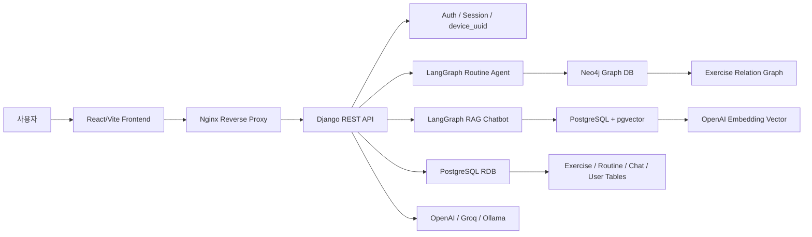
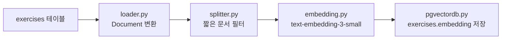
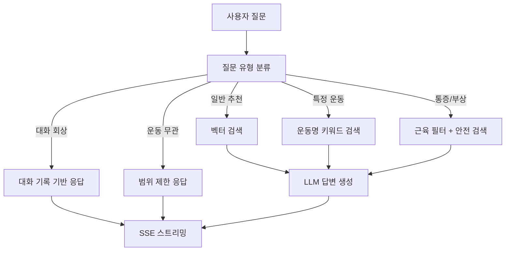
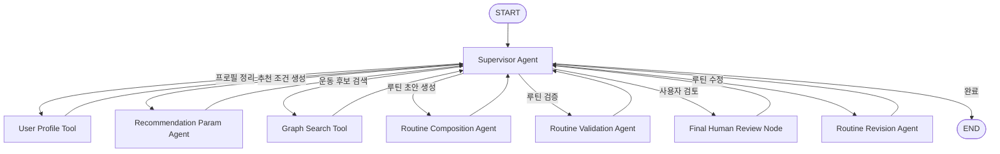
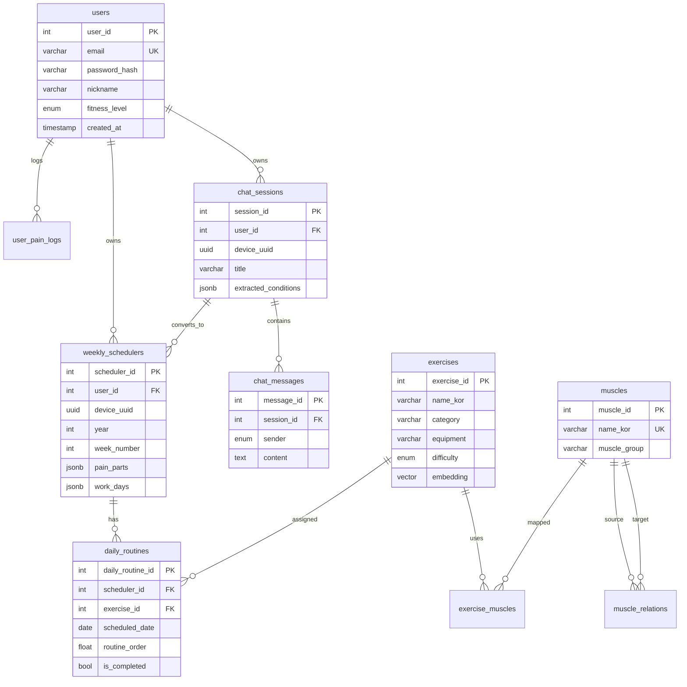
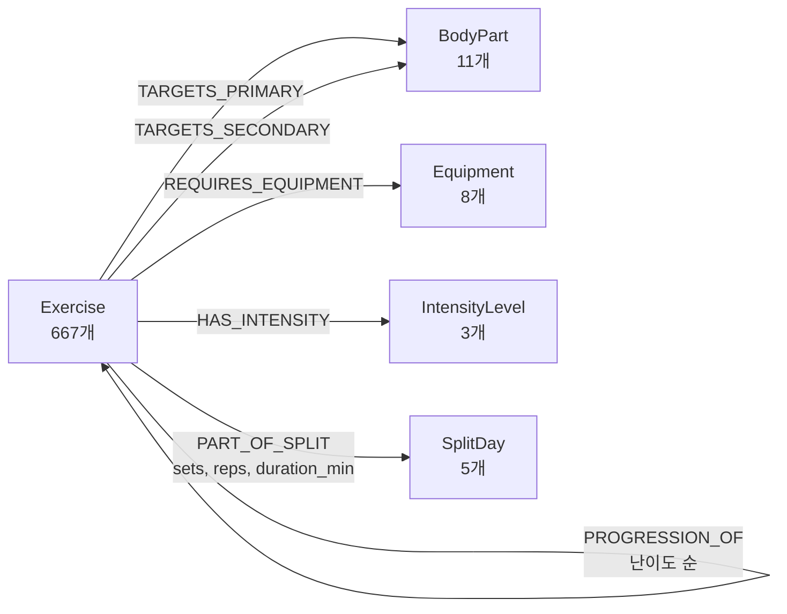
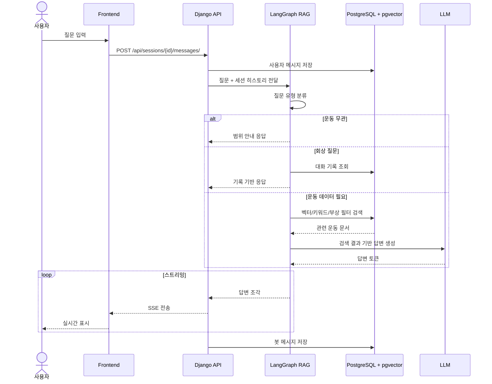
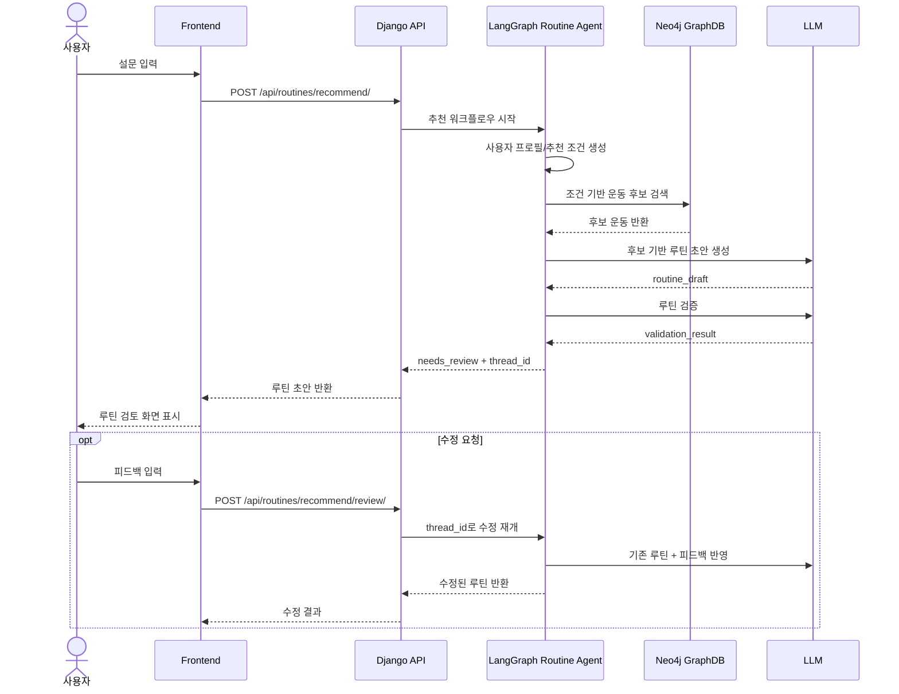

# HELBOTIN

<p align="center">
  <strong>SKN27 4th PROJECT · AI Fitness Routine & Exercise Consultation Service</strong><br />
  운동 라이브러리, 개인 맞춤 루틴 추천, AI 운동 챗봇을 연결한 운동 루틴 관리 웹 서비스
</p>

---

## Demo

- Web: [https://sk-camp.cloud](https://sk-camp.cloud)
- API Docs: README의 [API 명세서](#15-api-명세서) 참고

---

## 목차

1. [프로젝트 개요](#1-프로젝트-개요)
2. [팀 소개](#2-팀-소개-skn27-4팀)
3. [주제 선정 배경](#3-주제-선정-배경)
4. [타겟 사용자](#4-타겟-사용자)
5. [서비스 모델](#5-서비스-모델)
6. [시스템 아키텍처](#6-시스템-아키텍처)
7. [RAG 파이프라인](#7-rag-파이프라인)
8. [AI 챗봇](#8-ai-챗봇)
9. [AI 루틴 추천 Agent](#9-ai-루틴-추천-agent)
10. [ERD 및 Neo4j 그래프 스키마](#10-erd-및-neo4j-그래프-스키마)
11. [시퀀스 다이어그램](#11-시퀀스-다이어그램)
12. [화면설계서](#12-화면설계서)
13. [테스트 시나리오](#13-테스트-시나리오)
14. [RAG 품질평가](#14-rag-품질평가)
15. [API 명세서](#15-api-명세서)
16. [기술 스택](#16-기술-스택)
17. [Project Structure](#17-project-structure)
18. [Installation & Run](#18-installation--run)
19. [Environment Variables](#19-environment-variables)
20. [Future Work](#20-future-work)
21. [각자 회고](#21-각자-회고)
22. [참고 문서](#22-참고-문서)

---

## 1. 프로젝트 개요

HELBOTIN은 **헬스 보이 루틴**이라는 의미를 담은 AI 운동 루틴 추천 서비스입니다. 운동 라이브러리, 개인 맞춤 운동 루틴 추천, AI 운동 챗봇을 통해 사용자가 더 쉽고 꾸준하게 운동을 이어갈 수 있도록 돕습니다.

운동을 꾸준히 이어가기 위해서는 **다양성**이 필요합니다. 같은 운동 루틴을 반복하면 몸이 해당 동작에 적응하여 칼로리 소모가 줄어들고, 근육 성장이 정체되는 **플래토(Plateau) 현상**이 발생할 수 있습니다. 또한 단조로운 루틴은 운동에 대한 흥미 자체를 떨어뜨립니다.

> "같은 부위, 다른 자극. 뻔한 루틴을 깨다."

---

## 2. 팀 소개 (SKN27 4팀)

| 이름   | 담당                                     |
| ------ | ---------------------------------------- |
| 이재희 | 팀장, 서비스 기획, 프론트엔드, AWS 배포  |
| 김필주 | AI 루틴 추천, LangGraph 추천 워크플로우  |
| 김경수 | RAG 기반 챗봇, pgvector 검색, SSE 응답   |
| 주연중 | Neo4j GraphDB, 운동 관계 데이터 구축     |
| 박창제 | 인증/인가, 사용자 관리, 게스트 세션 처리 |

---

## 3. 주제 선정 배경

### 3.1 문제 정의

| 대상                  | 문제                                                   |
| --------------------- | ------------------------------------------------------ |
| 운동 경험자           | 반복되는 루틴으로 인한 정체기 및 흥미 저하             |
| 운동 초보자           | 어떤 운동을 어떻게 시작해야 할지 판단하기 어려움       |
| 통증·부상 이력 사용자 | 피해야 할 운동과 대체 운동을 구분하기 어려움           |
| 공통 사용자           | 운동 자세, 호흡, 주의사항 정보가 여러 곳에 흩어져 있음 |

### 3.2 해결 방향

| 해결 기능           | 설명                                                  |
| ------------------- | ----------------------------------------------------- |
| 운동 라이브러리     | 900개 이상의 운동 정보, 영상, 자세 가이드 제공        |
| 개인 맞춤 루틴 추천 | 목표, 수준, 통증, 요일, 시간 기반 주간 루틴 자동 구성 |
| AI 운동 챗봇        | 운동 질문을 분류하고 RAG 검색 결과 기반 답변 제공     |
| 루틴 관리           | 수행 체크, 대체 운동 선택, 데일리 메모 저장           |

---

## 4. 타겟 사용자

| 사용자 유형             | 겪는 문제                             | HELBOTIN이 제공하는 가치              |
| ----------------------- | ------------------------------------- | ------------------------------------- |
| 운동 초보자             | 운동 순서와 시작 방법을 모름          | 목표와 수준에 맞는 첫 루틴 제공       |
| 정체기를 겪는 경험자    | 반복 루틴으로 자극과 흥미가 감소      | 같은 부위에 새로운 운동 자극 제공     |
| 통증·부상 이력 사용자   | 피해야 할 운동을 구분하기 어려움      | 통증 부위를 고려한 대체 운동 제안     |
| 시간이 불규칙한 사용자  | 요일과 시간에 맞춰 루틴을 짜기 어려움 | 가용 시간 기반 주간 루틴 구성         |
| 운동 정보를 찾는 사용자 | 자세, 호흡, 주의사항이 흩어져 있음    | 운동 영상과 상세 가이드를 한곳에 제공 |

---

## 5. 서비스 모델

### 5.1 핵심 기능

| 기능               | 설명                                                        |
| ------------------ | ----------------------------------------------------------- |
| 운동 라이브러리    | 카테고리, 기구, 난이도, 검색어 기반 운동 탐색               |
| 운동 상세 정보     | 운동 영상, 설명, 시작 자세, 동작, 호흡, 주의사항 제공       |
| 맞춤 루틴 추천     | 나이, 성별, 수준, 통증 부위, 목표, 시간 기반 주간 루틴 생성 |
| 루틴 관리          | 요일별 운동 완료 체크, 세트/반복수 확인, 대체 운동 선택     |
| AI 운동 상담       | 운동 질문을 분류하고 RAG 검색 결과를 바탕으로 스트리밍 답변 |
| 사용자/게스트 세션 | 로그인 사용자와 device_uuid 기반 게스트 데이터 유지         |

### 5.2 차별점

- Neo4j 그래프 기반 운동 후보 탐색 및 대체 운동 관계 활용
- PostgreSQL + pgvector 기반 의미 검색 RAG 챗봇
- LangGraph 기반 루틴 추천, 검증, 사용자 피드백 반영 루프
- 통증/부상 조건을 추천 파라미터와 검증 단계에 반영
- 상담 세션, 루틴, 수행 기록을 분리 저장하는 지속 관리 구조

---

## 6. 시스템 아키텍처



### 구성 요소

| 영역        | 구성                                                        |
| ----------- | ----------------------------------------------------------- |
| Frontend    | React 18, Vite, React Router, Lucide React                  |
| Backend     | Django 4.2, Django REST Framework                           |
| Auth        | 세션/JWT 계열 인증, 로그인 사용자와 게스트 device_uuid 지원 |
| Primary DB  | PostgreSQL 16, pgvector                                     |
| Graph DB    | Neo4j, APOC 중심 운영                                       |
| AI Workflow | LangGraph 기반 루틴 추천 그래프와 RAG 챗봇 그래프           |
| Streaming   | Django `StreamingHttpResponse` 기반 SSE 토큰 스트리밍       |
| Deployment  | AWS EC2, Docker Compose, Nginx, Certbot HTTPS               |

---

## 7. RAG 파이프라인

상세 문서: [docs/RAG*프로젝트*정리.md](docs/RAG_프로젝트_정리.md), [docs/RAG*챗봇*기술명세.md](docs/RAG_챗봇_기술명세.md)

### 7.1 오프라인 인덱싱 파이프라인



| 단계   | 파일                                     | 역할                                                 |
| ------ | ---------------------------------------- | ---------------------------------------------------- |
| 로더   | `backend/api/services/RAG/loader.py`     | DB 행을 자연어 `page_content`와 metadata로 변환      |
| 분할   | `backend/api/services/RAG/splitter.py`   | 50자 미만 문서 필터링                                |
| 임베딩 | `backend/api/services/RAG/embedding.py`  | OpenAI `text-embedding-3-small`로 1536차원 벡터 생성 |
| 저장   | `backend/api/services/RAG/pgvectordb.py` | `exercises.embedding` 컬럼에 벡터 저장               |

### 7.2 런타임 RAG 흐름



### 7.3 주요 설계 결정

- 별도 vectorstore 테이블을 만들지 않고 `exercises.embedding` 컬럼을 직접 사용
- HNSW 인덱스와 검색 연산자를 cosine 기준(`<=>`)으로 통일
- 특정 운동 질문은 의미 검색보다 운동명 정확 검색을 우선 적용
- 회상 질문은 검색 없이 대화 기록만 사용해 검색 결과 오염을 방지
- 통증/부상 질문은 근육 브릿지 테이블과 난이도 제한을 함께 사용

---

## 8. AI 챗봇

AI 챗봇은 운동 관련 질문을 범위 안에서 처리하고, 운동 데이터에 기반한 답변을 토큰 단위로 스트리밍합니다.

### 8.1 질문 유형

| 유형           | 라우팅                        | 정의                            |
| -------------- | ----------------------------- | ------------------------------- |
| `specific`     | `retrieve_specific`           | 특정 운동명이 포함된 질문       |
| `general`      | `retrieve_general`            | 추천, 루틴, 일반 운동 지식 질문 |
| `injury`       | `retrieve_injury`             | 통증, 부상, 대체 운동 질문      |
| `recall`       | `recall` 또는 history/rewrite | 이전 대화 내용 자체를 묻는 질문 |
| `out_of_scope` | `out_of_scope`                | 운동 서비스 범위 밖 질문        |

### 8.2 챗봇 응답 안전성

- 운동 데이터에 없는 효과나 안전성을 단정하지 않도록 프롬프트 제한
- 통증/부상 질문에는 무리한 지속을 권하지 않고 중단·전문가 상담 안내
- 무릎, 손목, 허리처럼 관절 표현은 대표 근육 키워드로 보정
- 운동 무관 질문은 서비스 범위 안내 후 종료

---

## 9. AI 루틴 추천 Agent

상세 문서: [docs/ROUTINE_RECOMMENDATION_SERVICE.md](docs/ROUTINE_RECOMMENDATION_SERVICE.md)

### 9.1 LangGraph 구조



### 9.2 주요 Agent

| Agent / Tool               | 역할                                                          |
| -------------------------- | ------------------------------------------------------------- |
| Supervisor Agent           | 상태와 검증 결과를 보고 다음 노드 라우팅                      |
| User Profile Tool          | 프론트 설문 데이터를 추천 가능한 프로필로 정규화              |
| Recommendation Param Agent | 목표, 레벨, 장비, 통증, 척추 부하 조건을 검색 파라미터로 변환 |
| Graph Search Tool          | Neo4j 운동 그래프에서 부위별 후보 조회                        |
| Routine Composition Agent  | 후보 운동만 사용해 주간 루틴 초안 구성                        |
| Routine Validation Agent   | 누락 부위, 장비 불일치, 통증 위험, 움직임 편중 검증           |
| Routine Revision Agent     | 사용자 피드백에 따라 운동 제외, 대체, 재구성 수행             |
| Final Human Review Node    | 사용자 검토 단계로 루틴 초안을 반환                           |

---

## 10. ERD 및 Neo4j 그래프 스키마

### 10.1 ERD



### 10.2 Neo4j 그래프 스키마

상세 문서: [docs/planfit_graphdb_spec.md](docs/planfit_graphdb_spec.md)



| Label          | 수량 | 역할                          |
| -------------- | ---: | ----------------------------- |
| Exercise       |  667 | 5분할 추천 대상 운동          |
| BodyPart       |   11 | 주/보조 타겟 부위             |
| Equipment      |    8 | 장비 필터                     |
| IntensityLevel |    3 | 초급/중급/고급 난이도         |
| SplitDay       |    5 | 가슴, 등, 하체, 어깨, 팔 분할 |

---

## 11. 시퀀스 다이어그램

### 11.1 AI 챗봇 RAG 시퀀스



### 11.2 루틴 추천 및 피드백 시퀀스



---

## 12. 화면설계서

| 화면           | 주요 구성                                        | 사용자 액션                         | 연결 API                                                           |
| -------------- | ------------------------------------------------ | ----------------------------------- | ------------------------------------------------------------------ |
| 메인           | 히어로, 루틴 소개, 챗봇 소개, 운동 목록 미리보기 | 시작하기, 운동 상담, 전체 운동 보기 | `GET /api/exercises/featured/`                                     |
| 운동 백과      | 카테고리/기구/난이도 필터, 검색, 운동 카드       | 필터링, 상세 보기, 영상 확인        | `GET /api/exercises/`, `GET /api/exercises/{id}/`                  |
| 운동 상세 모달 | 영상, 설명, 자세, 호흡, 주의사항, 관련 운동      | 관련 운동 이동, 모달 닫기           | `GET /api/exercises/{id}/`                                         |
| 주간 루틴 설문 | 기본 정보, 통증 부위, 운동 요일, 목표, 시간      | 다음 단계, AI 추천 생성             | `POST /api/routines/recommend/`                                    |
| 루틴 확인      | 요일별 루틴, 완료 체크, 대체 운동, 데일리 메모   | 저장, 대체 운동 선택, 다시 설계     | `GET/POST /api/routines/`                                          |
| 운동 상담      | 세션 목록, 메시지, 스트리밍 답변                 | 새 상담, 질문 입력, 세션 삭제/수정  | `GET/POST /api/sessions/`, `GET/POST /api/sessions/{id}/messages/` |
| 로그인         | 이메일, 비밀번호                                 | 로그인, 회원가입 이동               | `POST /api/auth/login/`                                            |
| 회원가입       | 닉네임/이메일 중복 확인, 비밀번호                | 가입, 로그인 이동                   | `POST /api/auth/register/`                                         |

---

## 13. 테스트 시나리오

상세 문서: [docs/SERVICE_AB_TEST_LIST.md](docs/SERVICE_AB_TEST_LIST.md), [docs/ROUTINE_RECOMMENDATION_SERVICE.md](docs/ROUTINE_RECOMMENDATION_SERVICE.md)

### 13.1 서비스 API 테스트 요약

2026-06-09 로컬 Docker 환경 기준 서비스 기능 테스트를 실행했습니다.

| 구분           |                 결과 |
| -------------- | -------------------: |
| 전체 테스트    |                 31건 |
| 성공/정상 동작 |                 29건 |
| 실패           |                  2건 |
| 주요 결함      | 비밀번호 정책 미적용 |

### 13.2 주요 테스트 범위

| 범위           | 대표 시나리오                                                | 상태                            |
| -------------- | ------------------------------------------------------------ | ------------------------------- |
| 인증/계정      | 회원가입, 로그인, 로그아웃, 중복 검증, 현재 사용자 조회      | 대부분 성공, 비밀번호 정책 결함 |
| 챗봇           | 일반 질문, 특정 운동 질문, 통증 질문, 비운동 질문, 세션 유지 | 성공                            |
| 운동 정보 조회 | 목록, 상세, featured, 프론트 검색/필터, 빈 결과 처리         | 성공                            |
| 루틴 저장/조회 | 저장 루틴 조회, 상세 조회, 권한 검증, 빈 목록 처리           | 성공                            |
| 프론트 공통    | 새로고침 세션 유지, API 실패 표시                            | 부분 성공                       |

### 13.3 루틴 추천 테스트 요약

| 구분          | 대표 시나리오                                 | 결과                |
| ------------- | --------------------------------------------- | ------------------- |
| 기본 추천     | 근비대/스트렝스/다이어트/체력유지 목표별 추천 | 성공                |
| 사용자 조건   | 초급/중급/상급, 여성, 고령 조건               | 성공 또는 부분 성공 |
| 통증 조건     | 허리, 무릎, 어깨, 손목, 복수 통증             | 부분 성공           |
| HITL 승인     | 추천 후 승인                                  | 성공                |
| HITL 수정     | 벤치 프레스 제외/교체, 강도 상향/하향         | 성공                |
| 고위험 케이스 | `health + lower_back + 45분`                  | 루프 위험           |

---

## 14. RAG 품질평가

상세 문서: [docs/RAG*프로젝트*정리.md](docs/RAG_프로젝트_정리.md), [docs/RAG*챗봇*기술명세.md](docs/RAG_챗봇_기술명세.md)

### 14.1 평가 관점

| 평가 항목        | 확인 방법                                                  | 현재 상태                     |
| ---------------- | ---------------------------------------------------------- | ----------------------------- |
| 질문 분류 정확도 | general/specific/injury/recall/out_of_scope 대표 질문 실행 | 대표 질문 정상 응답           |
| 검색 적합도      | 특정 운동명 정확 검색, 일반 질문 벡터 검색 결과 확인       | 정확 일치 우선 정렬 적용      |
| 맥락 유지        | 이전 대화의 운동명을 참조하는 후속 질문 테스트             | query rewrite 및 history 반영 |
| 검색 오염 방지   | "처음 물어본 운동" 같은 회상 질문 테스트                   | recall 분리로 개선            |
| 안전성           | 통증/부상 질문에서 무리한 운동 지속 권장 여부 확인         | 중단/전문가 상담 안내         |
| 범위 제한        | 주식, 음식점, 코딩 등 운동 무관 질문                       | out_of_scope 응답             |

### 14.2 확인된 개선 사항

- `embedding <=> query_vector` 방식으로 HNSW cosine 인덱스 활용
- 특정 운동 질문에서 벡터 검색보다 이름 검색을 우선해 변형 운동 오선택 감소
- 회상 질문을 검색하지 않도록 분리해 대화 기록 오염 방지
- 참조 질문은 검색 전 query rewriting으로 실제 운동명으로 치환

### 14.3 보완 예정

| 항목          | 보완 방향                                                 |
| ------------- | --------------------------------------------------------- |
| 정량 지표     | RAGAS, Hit Rate, MRR, Top-k Recall 최종 수치 산출         |
| 평가 데이터셋 | 운동명, 통증, 루틴, 회상, 범위 외 질문 세트 확장          |
| 근거 표시     | 답변에 참고 운동명 또는 출처 운동 데이터를 더 명확히 표시 |
| 응답 지연     | rerank 사용 여부와 검색 후보 수 최적화                    |

---

## 15. API 명세서

### 15.1 운동 API

| Method | Endpoint                        | 설명                                            |
| ------ | ------------------------------- | ----------------------------------------------- |
| GET    | `/api/exercises/`               | 운동 목록 조회. `full=1` 사용 시 상세 필드 포함 |
| GET    | `/api/exercises/featured/`      | 홈 화면 대표 운동 조회. `limit` 지원            |
| GET    | `/api/exercises/<exercise_id>/` | 운동 상세 정보 조회                             |

### 15.2 상담 API

| Method       | Endpoint                               | 설명                                |
| ------------ | -------------------------------------- | ----------------------------------- |
| GET          | `/api/sessions/`                       | 상담 세션 목록 조회                 |
| POST         | `/api/sessions/`                       | 새 상담 세션 생성                   |
| GET          | `/api/sessions/<session_id>/`          | 상담 세션 상세 조회                 |
| PATCH/DELETE | `/api/sessions/<session_id>/`          | 세션 제목 수정 또는 삭제            |
| GET          | `/api/sessions/<session_id>/messages/` | 상담 메시지 조회                    |
| POST         | `/api/sessions/<session_id>/messages/` | 사용자 메시지 저장 및 SSE 답변 생성 |

### 15.3 인증 API

| Method | Endpoint                    | 설명             |
| ------ | --------------------------- | ---------------- |
| GET    | `/api/auth/csrf/`           | CSRF 쿠키 발급   |
| POST   | `/api/auth/register/`       | 회원가입         |
| POST   | `/api/auth/login/`          | 로그인           |
| POST   | `/api/auth/logout/`         | 로그아웃         |
| GET    | `/api/auth/me/`             | 현재 사용자 조회 |
| GET    | `/api/auth/check-nickname/` | 닉네임 중복 확인 |
| GET    | `/api/auth/check-email/`    | 이메일 중복 확인 |

### 15.4 루틴 API

| Method | Endpoint                          | 설명                            |
| ------ | --------------------------------- | ------------------------------- |
| GET    | `/api/routines/`                  | 주차별 루틴 조회                |
| POST   | `/api/routines/`                  | 주차별 루틴 저장                |
| POST   | `/api/routines/recommend/`        | AI 루틴 추천 생성               |
| POST   | `/api/routines/recommend/review/` | 추천 루틴 승인/수정 피드백 처리 |

---

## 16. 기술 스택

### Frontend

- React 18
- Vite
- React Router
- Lucide React
- React Markdown

### Backend

- Django 4.2
- Django REST Framework
- django-cors-headers
- Simple JWT
- Gunicorn
- WhiteNoise

### Database

- PostgreSQL 16
- pgvector
- Neo4j
- APOC

### AI

- OpenAI
- LangChain
- LangGraph
- Groq
- Ollama
- CrossEncoder rerank 옵션

### DevOps

- Docker Compose
- AWS EC2
- Nginx
- Certbot HTTPS

---

## 17. Project Structure

```text
SKN27-4th-4team/
├── backend/
│   ├── api/
│   │   ├── services/
│   │   │   ├── RAG/
│   │   │   ├── chatbot/
│   │   │   └── routine_recommender.py
│   │   ├── auth_views.py
│   │   ├── models.py
│   │   └── views.py
│   ├── config/
│   ├── data/
│   ├── db/
│   └── recommendation_service/
├── frontend/
│   ├── public/
│   │   └── videos/
│   └── src/
│       ├── components/
│       └── pages/
├── docs/
├── docker-compose.yml
├── docker-compose.prod.yml
├── AWS_DEPLOY.md
└── README.md
```

---

## 18. Installation & Run

### Local Docker

```bash
docker compose up --build
```

- Frontend: `http://localhost:5173`
- Backend: `http://localhost:8000`
- Neo4j Browser: `http://localhost:7474`

### Production Docker

```bash
docker compose --env-file .env.prod -f docker-compose.prod.yml up -d --build
```

배포 상세 절차는 [AWS_DEPLOY.md](AWS_DEPLOY.md)를 참고합니다.

---

## 19. Environment Variables

`.env.prod` 또는 로컬 `.env`에서 주요 값을 설정합니다.

| 변수                                                      | 설명                     |
| --------------------------------------------------------- | ------------------------ |
| `DB_HOST`, `DB_PORT`, `DB_NAME`, `DB_USER`, `DB_PASSWORD` | PostgreSQL 연결 정보     |
| `NEO4J_URI`, `NEO4J_USER`, `NEO4J_PASSWORD`               | Neo4j 연결 정보          |
| `SECRET_KEY`, `DEBUG`, `ALLOWED_HOSTS`                    | Django 운영 설정         |
| `CORS_ALLOWED_ORIGINS`, `CSRF_TRUSTED_ORIGINS`            | 프론트 도메인 허용       |
| `OPENAI_API_KEY`, `OPENAI_MODEL`                          | OpenAI 모델 설정         |
| `GROQ_API_KEY`, `GROQ_MODEL`                              | Groq 모델 설정           |
| `LLM_PROVIDER`, `EMBEDDING_PROVIDER`                      | LLM/임베딩 provider 선택 |
| `CHATBOT_ENABLE_RERANK`                                   | 챗봇 rerank 사용 여부    |

---

## 20. Future Work

- 루틴 추천 결과에 대한 정량 평가 지표와 테스트 케이스 확대
- 통증·부상 조건의 GraphDB 후보 단계 필터링 강화
- HITL 연속 수정에서 특정 부위 수정 범위 보존 개선
- 상담 RAG에서 운동별 단일 벡터 구조를 다중 청크 검색 구조로 개선
- RAGAS, Hit Rate, MRR 기반 RAG 품질 리포트 자동화
- 모바일 운동 기록 경험 및 반응형 UI 개선
- AWS 운영 환경에서 Secrets Manager 또는 Parameter Store 적용
- Neo4j 그래프 데이터 구축 자동화와 운영 모니터링 강화

---

## 21. 각자 회고

| 이름   | 회고                                                                                                                                                                                                                                                                                                          |
| ------ | ------------------------------------------------------------------------------------------------------------------------------------------------------------------------------------------------------------------------------------------------------------------------------------------------------------- |
| 이재희 | 전체 서비스 흐름을 사용자가 실제로 쓸 수 있는 화면으로 연결하는 과정이 가장 중요했습니다. 프론트엔드와 배포를 맡으며 기능 구현뿐 아니라 HTTPS, 도메인, Docker 운영까지 경험했고, 로컬에서 잘 되는 기능도 운영 환경에서는 메모리와 포트, 보안그룹 같은 현실적인 문제가 함께 해결되어야 한다는 점을 배웠습니다. |
| 김필주 | 루틴 추천은 LLM에게 바로 맡기면 일관성과 안전성이 흔들릴 수 있어, GraphDB 후보 검색과 정책 검증을 결합하는 구조가 필요했습니다. LangGraph로 추천 단계를 나누면서 추천 생성, 검증, 사용자 피드백 반영의 흐름을 명확히 설계할 수 있었습니다.                                                                    |
| 김경수 | RAG 챗봇에서는 검색이 항상 좋은 답을 만드는 것이 아니라, 회상 질문처럼 검색이 오히려 오염을 만들 수 있다는 점이 핵심이었습니다. 질문 유형 분류와 query rewriting을 통해 대화 맥락과 운동 데이터 검색을 분리하는 경험을 했습니다.                                                                              |
| 주연중 | Neo4j 그래프를 구축하면서 운동 데이터는 단순 목록보다 관계로 표현했을 때 대체 운동, 유사 운동, progression 탐색에 더 강해진다는 것을 확인했습니다. 전처리 과정에서 카테고리 통합과 매핑 실패를 다루는 것이 그래프 품질에 큰 영향을 준다는 점을 배웠습니다.                                                    |
| 박창제 | 인증과 사용자 관리는 서비스의 진입점이라 작은 검증 누락도 전체 신뢰도에 영향을 줍니다. 로그인 사용자와 게스트 device_uuid를 함께 처리하면서 데이터 소유권, 세션 유지, API 권한 검증을 명확히 나누는 것이 중요하다는 점을 배웠습니다.                                                                          |

---

## 22. 참고 문서

- [AWS_DEPLOY.md](AWS_DEPLOY.md)
- [docs/ROUTINE_RECOMMENDATION_SERVICE.md](docs/ROUTINE_RECOMMENDATION_SERVICE.md)
- [docs/RAG*프로젝트*정리.md](docs/RAG_프로젝트_정리.md)
- [docs/RAG*챗봇*기술명세.md](docs/RAG_챗봇_기술명세.md)
- [docs/planfit_graphdb_spec.md](docs/planfit_graphdb_spec.md)
- [docs/SERVICE_AB_TEST_LIST.md](docs/SERVICE_AB_TEST_LIST.md)
- [docs/rag_evolution_all.html](docs/rag_evolution_all.html)
