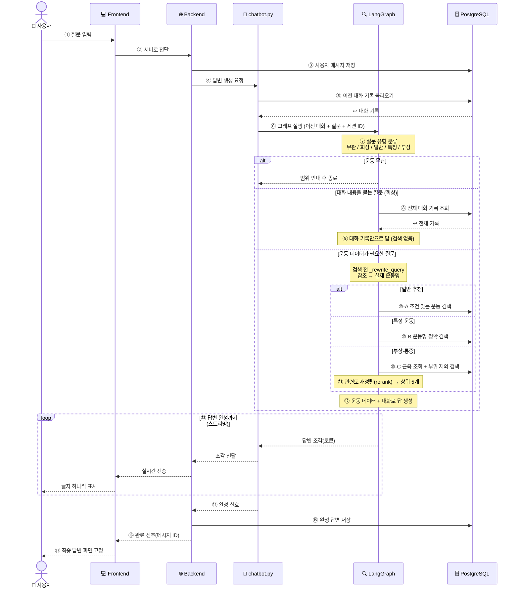

# 피트니스 RAG 챗봇 — 프로젝트 정리

> 운동 추천·설명을 제공하는 대화형 RAG 챗봇.
> 핵심 스택: **PostgreSQL + pgvector** (하이브리드 검색), **LangGraph** (대화 그래프), **OpenAI** (임베딩·LLM), **Django** (백엔드).

---

## 1. 시스템 개요

사용자가 운동에 대해 질문하면, 질문 유형을 분류한 뒤 운동 데이터를 검색하고 LLM이 답변을 토큰 단위로 스트리밍한다. 대화 맥락(이전에 무엇을 물었는지)을 기억해 후속 질문도 처리한다.

구성은 크게 두 부분이다.

- **오프라인 인덱싱 파이프라인**: 운동 데이터를 적재 → 임베딩 → PostgreSQL에 저장.
- **런타임 대화 그래프(LangGraph)**: 질문 분류 → 유형별 검색 → 답변 생성.

---

## 2. 데이터 파이프라인 (오프라인 인덱싱)

| 단계 | 파일 | 역할 |
|------|------|------|
| 로더 | `loader.py` | DB 행을 언패킹해 자연어 `page_content` + `metadata`(검색 필터용)로 변환, LangChain `Document`로 묶음 |
| 분할 | `splitter.py` | 50자 미만 문서 필터(의미 없는 청크 방지) — 확인 결과 해당 문서 없음 |
| 임베딩 | `embedding.py` | `page_content`만 뽑아 `text-embedding-3-small`로 벡터(1536차원) 일괄 변환 |
| 저장 | `pgvectordb.py` | `exercises` 테이블의 `embedding` 컬럼에 `UPDATE ... SET embedding = %s::vector` |

`description / starting_position / movement / breathing / related_exercises` 등 누락 항목을 DB에 추가해 답변 품질을 보강했다.

---

## 3. 런타임 시퀀스 다이어그램

---

## 4. LangGraph 구성의 진화

설계는 단계적으로 발전했다. (상세 다이어그램은 `docs/rag_evolution_all.html` 참고)

1. **기본 그래프** — `START → retrieve → generate → END`
2. **조건 분기(conditional edge)** — `classify`로 질문 유형별 `retrieve` 분기(general/specific/injury)
3. **Adaptive RAG** — 운동 무관 질문용 `out_of_scope`, 부상 분기에 rerank 추가
4. **recall 노드 추가** — 대화 내용을 묻는 질문을 검색 없이 처리
5. **최종** — 검색 경로에 query rewriting을 더해 참조 질문까지 정확 처리

---

## 5. 어려웠던 점 & 해결

### 5-1. 임베딩 저장 방식 — vectorstore vs 임베딩 컬럼 재사용

강의에서는 `PGVector.from_documents`로 vectorstore를 만들어 `similarity_search`로 검색하는 방식을 썼고, 그 방식이 마음에 들었다. 하지만 `PGVector.from_documents`는 **새로운 테이블을 생성**한다. 우리는 이미 `exercises` 테이블에 `embedding` 컬럼을 직접 만들어 두었기 때문에, 그 컬럼을 그대로 활용하고 싶었다.

그래서 초기에는 각 컬럼을 쿼리로 직접 검색해 답을 만들었는데, **쿼리에 원하는 컬럼이 없으면 답변에 반영되지 않는** 한계가 있었다(그래서 누락 컬럼을 추가). 최종적으로는 vectorstore 별도 테이블을 만들지 않고, `exercises.embedding` 컬럼에 벡터를 저장한 뒤 `embedding <=> query_vector`로 **유사도 검색을 직접 구현**하는 방향으로 정리했다. → 기존 스키마(운동 테이블 + 임베딩 컬럼)를 그대로 활용하면서 의미 기반 검색의 장점을 얻었다.

### 5-2. 멀티턴 회상 질문이 검색에 오염되는 문제 (핵심)

| 항목 | 내용 |
|------|------|
| **문제** | 여러 운동을 물어본 뒤 "처음 물어본 운동이 뭐야?"라고 하면, 실제 첫 운동(데드리프트)이 아니라 비슷한 변형(스태거드 데드리프트)을 답했다. |
| **원인** | 이런 '대화 기억' 질문까지 일반 질문처럼 벡터 검색을 거치면서, 의미가 유사한 변형 운동이 검색되어 컨텍스트에 주입됐고, "운동 데이터 기반으로 답하라"는 프롬프트 규칙 때문에 모델이 대화 기록의 정답 대신 검색된 변형 운동명을 출력했다. |
| **해결** | 분류에 `recall` 유형을 신설하고, 검색 없이 **전체 대화 기록만으로** 답하는 전용 노드로 분기했다. 운동 데이터를 주입하지 않아 오염이 원천 차단된다. |
| **기대효과** | "처음 물어본 운동" 질문에 항상 정확한 운동명으로 답한다. 전체 기록을 보므로 대화가 길어져도 정확하고, 불필요한 검색을 건너뛰어 지연·비용도 줄어든다. |

### 5-3. 참조 + 속성 결합 질문 ("처음 물어본 운동의 호흡법은?")

회상과 운동 정보 조회가 섞인 질문은 검색이 필요하다. 검색 직전에 **query rewriting**을 적용해 "처음 물어본 운동" 같은 참조를 실제 운동명("데드리프트")으로 치환한 뒤 검색하도록 했다. → 참조 질문도 올바른 운동으로 답한다.

### 5-4. 검색이 변형 운동을 잘못 고르는 문제

"데드리프트"를 찾을 때 의미 유사도 검색이 "스태거드/트랩바 데드리프트" 같은 변형을 1순위로 뽑는 경우가 있었다. **정확히 일치하는 이름을 1순위로 정렬**(그다음 짧은 기본형 우선)하도록 `keyword_search`를 보강하고, 단일 운동을 가리키는 질문은 의미 검색 대신 이름 검색으로 처리하도록 했다.

### 5-5. 벡터 거리 연산자와 인덱스 불일치

HNSW 인덱스는 cosine(`vector_cosine_ops`)으로 만들었는데 검색 쿼리는 L2(`<->`)를 써서 인덱스를 제대로 타지 못할 위험이 있었다. → 쿼리를 cosine 연산자(`<=>`)로 통일해 인덱스를 정상 활용하도록 수정.

---

## 6. 정리

기존 스키마(운동 테이블 + 임베딩 컬럼)를 살리는 방향으로 RAG 검색을 직접 구현했고, 대화형 사용에서 드러난 **회상 질문 오염**이라는 핵심 결함을 "검색이 필요한 질문"과 "대화 기록만으로 답할 질문"을 분리하는 구조로 해결했다. 이를 통해 멀티턴 대화에서도 맥락을 정확히 유지하는 챗봇을 완성했다.
