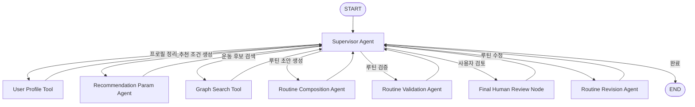
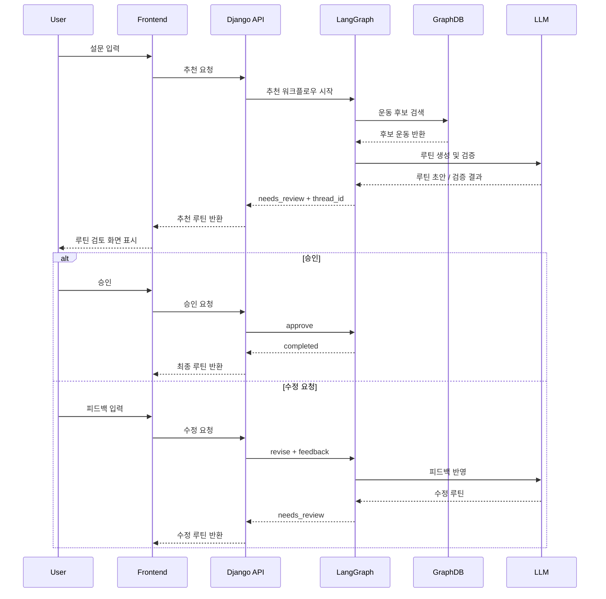

# AI Routine Recommendation Service

사용자의 설문 정보를 바탕으로 운동 목표, 운동 가능 요일, 운동 부위, 통증 부위, 운동 수준을 분석하고, GraphDB 기반 운동 후보와 LLM 에이전트 워크플로우를 조합해 개인 맞춤형 주간 운동 루틴을 추천하는 서비스입니다.

단순히 LLM에게 루틴 생성을 맡기는 방식이 아니라, **설문 데이터 -> 추천 파라미터 변환 -> GraphDB 운동 후보 검색 -> 루틴 생성 -> 검증 -> 사용자 피드백 기반 재추천** 흐름으로 구성했습니다.

## LangGraph 구조

`Supervisor Agent`가 현재 추천 상태를 확인해 다음 실행할 노드를 결정합니다. 각 노드는 작업을 수행한 뒤 다시 Supervisor로 돌아오며, 검증 실패나 사용자 수정 요청이 있으면 `Routine Revision Agent`를 통해 루틴을 보완합니다.

## 루틴 생성 데이터 흐름

```mermaid
flowchart LR
    survey["Survey"] --> user_profile_data["User Profile"]
    user_profile_data --> recommendation_params["Recommendation Params"]
    recommendation_params --> graph_db["GraphDB Search"]
    graph_db --> exercise_candidates["Exercise Candidates"]
    exercise_candidates --> routine_draft["Routine Draft"]
    routine_draft --> validation_result["Validation Result"]
    validation_result --> human_review_data["Human Review"]
    human_review_data --> final_routine["Final Routine"]
```

## 루틴 생성 및 피드백 시퀀스

위 시퀀스는 사용자가 설문을 제출한 뒤 루틴 초안이 생성되고, 최종적으로 사용자가 승인하거나 수정 요청을 남기는 전체 실행 흐름을 나타냅니다.

초기 추천 요청에서는 프론트엔드가 설문 데이터를 Django API로 전달하고, API는 LangGraph 워크플로우를 실행합니다. LangGraph는 사용자 프로필과 추천 조건을 구성한 뒤 GraphDB에서 실제 운동 후보를 조회하고, LLM을 통해 후보 안에서만 루틴 초안을 생성합니다. 생성된 루틴은 검증 단계를 거친 뒤 바로 확정되지 않고 `needs_review` 상태와 `thread_id`를 함께 프론트엔드에 반환합니다.

사용자가 루틴을 승인하면 같은 `thread_id`로 승인 요청이 전달되고, LangGraph는 해당 추천 세션을 `completed` 상태로 종료합니다. 반대로 사용자가 수정 요청을 입력하면 피드백이 `revise + feedback` 형태로 전달되며, 기존 루틴과 검증 결과를 바탕으로 수정 루틴을 다시 생성한 뒤 다시 검토 단계로 돌아갑니다. 이 구조 덕분에 추천 결과를 한 번에 확정하지 않고, 사용자 피드백을 반영하는 Human-in-the-loop 흐름을 유지할 수 있습니다.

## 주요 에이전트 구성

| Agent | 역할 | 사용하는 데이터 |
|---|---|---|
| `Supervisor Agent` | 전체 추천 흐름을 제어하고 다음 실행 단계를 결정 | 현재 추천 상태, 검증 결과, 사용자 피드백 |
| `User Profile Tool` | 설문 데이터를 추천 가능한 사용자 프로필로 정리 | 나이, 성별, 운동 수준, 목표, 통증 부위, 운동 요일 |
| `Recommendation Param Agent` | 사용자 프로필을 GraphDB 검색 조건으로 변환 | 목표, 장비, 운동 부위, 세션 시간, 허리 부담도 |
| `Graph Search Tool` | Neo4j GraphDB에서 조건에 맞는 운동 후보 검색 | 운동 ID, 부위, 장비, 난이도, 운동 관계 데이터 |
| `Routine Composition Agent` | 검색된 후보 운동으로 주간 루틴 초안 생성 | GraphDB 운동 후보, 목표별 세트/반복 정책 |
| `Routine Validation Agent` | 생성된 루틴이 정책과 조건을 만족하는지 검증 | 필수 운동, 운동 개수, 장비 조건, 통증 제한 |
| `Routine Revision Agent` | 검증 실패 또는 사용자 피드백을 반영해 루틴 수정 | 기존 루틴, 검증 이슈, 사용자 수정 요청 |
| `Final Human Review Node` | 최종 루틴을 사용자 검토 단계로 전달 | 루틴 초안, 검증 결과 |

## 사용하는 주요 데이터

| 데이터 | 설명 |
|---|---|
| 사용자 설문 데이터 | 운동 목표, 운동 수준, 운동 장소, 운동 가능 요일, 부위 분할, 통증 부위 |
| 운동 데이터 | 운동명, 부위, 장비, 난이도, 설명, 주의사항, 영상/이미지 경로 |
| GraphDB 관계 데이터 | 운동 간 대체 관계, 유사 운동, 난이도 progression 관계 |
| 정책 데이터 | 목표별 장비 제한, 필수 운동, 세트/반복/휴식 기준 |
| 사용자 피드백 | 추천 루틴 승인 또는 수정 요청 내용 |

## 핵심 기능

### 1. 설문 기반 개인화 추천

사용자는 운동 목표, 운동 가능 시간, 운동 요일, 부위 분할, 통증 부위 등을 입력합니다. 서비스는 이 정보를 기반으로 사용자 프로필을 생성하고, 추천 조건을 자동으로 구성합니다.

### 2. GraphDB 기반 운동 후보 검색

운동 후보는 LLM이 임의로 생성하지 않고, Neo4j GraphDB에 저장된 운동 데이터에서 가져옵니다. 부위, 장비, 난이도, 허리 부담도, 운동 목표 등을 기준으로 후보를 필터링합니다.

### 3. 목표별 추천 정책 적용

운동 목표에 따라 추천 기준을 다르게 적용합니다.

| 목표 | 추천 방향 |
|---|---|
| `strength` | 고중량, 저반복, 긴 휴식 |
| `hypertrophy` | 중간 반복, 충분한 볼륨 |
| `fat_loss` | 고반복, 짧은 휴식 |
| `health` | 안정성 중심, 머신/저부담 운동 위주 |

근력과 근비대 목표에서는 주요 복합 운동을 우선 포함하도록 정책을 적용합니다.

| 부위 | 대표 운동 |
|---|---|
| `CHEST` | 벤치 프레스 |
| `BACK` | 데드리프트 |
| `LEG` | 바벨 스쿼트 |
| `SHOULDER` | 오버헤드 프레스 |

### 4. 루틴 검증 및 재추천

생성된 루틴은 바로 반환되지 않고 검증 단계를 거칩니다.

- 선택한 분할 부위가 모두 포함되었는지 확인합니다.
- 각 부위별 운동 개수가 충분한지 확인합니다.
- GraphDB 후보에 없는 운동이 포함되지 않았는지 확인합니다.
- 사용자가 제외한 운동이 다시 들어가지 않았는지 확인합니다.
- 통증 부위에 위험한 운동이 포함되지 않았는지 확인합니다.
- 목표별 필수 운동이 누락되지 않았는지 확인합니다.

검증 실패 시 `Routine Revision Agent`가 기존 루틴과 검증 이슈를 바탕으로 루틴을 다시 수정합니다.

### 5. 사용자 피드백 기반 수정

최종 루틴은 사용자 검토 단계를 거칩니다. 사용자가 승인하면 추천이 완료되고, 수정 요청을 남기면 기존 루틴과 피드백을 바탕으로 재추천을 수행합니다.

## 장점

- LLM 단독 추천이 아니라 GraphDB 기반 후보 검색을 함께 사용해 추천 근거가 명확합니다.
- 설문 데이터를 기반으로 개인의 목표, 요일, 통증 부위, 운동 수준을 반영할 수 있습니다.
- 추천 결과를 검증하는 단계가 있어 잘못된 운동이나 조건에 맞지 않는 루틴을 줄일 수 있습니다.
- 사용자 피드백을 반영한 재추천 흐름이 있어 실제 서비스 사용성에 가깝습니다.
- LangGraph 기반으로 각 단계가 에이전트 단위로 분리되어 있어 유지보수와 확장이 쉽습니다.

## 실제 AB/HITL 테스트 결과

테스트 일자: 2026-06-09
실행 환경: local Docker Compose backend
추적 도구: LangSmith `Modular RAG TUTORIAL` 프로젝트
테스트 당시 모델 설정: `LLM_PROVIDER=openai`, `OPENAI_MODEL=gpt-5-nano`

현재 설문 UI에는 장비 직접 선택 기능이 없으므로 `machine only`, `덤벨 없이`, `바벨 없이` 같은 장비 직접 선택 테스트는 정식 UI 시나리오에서 제외했습니다. 장비 정책은 사용자가 직접 선택하는 값이 아니라 운동 목표에 따라 백엔드에서 자동 적용되는 범위만 확인했습니다.

### 테스트 시나리오 목록

| ID | 실제 추천 시나리오 | 결과 | 확인 내용 |
|---|---|---|---|
| S01 | 28세 남성 / 중급 / 통증 없음 / 근비대 / 60분 / 월-금 5분할 | 성공 | 5일 루틴 생성, `needs_review` 반환. 근비대 목표와 필수 운동 정책 반영. |
| S02 | 28세 남성 / 상급 / 통증 없음 / 스트렝스 / 90분 / 월-금 5분할 | 성공 | 스트렝스 목표, 90분 5개 운동 정책, 필수 복합 운동 정책 반영. |
| S03 | 28세 남성 / 중급 / 통증 없음 / 다이어트 / 60분 / 월-금 5분할 | 성공 | `goal=fat_loss` 변환 및 후보 검색 정상. |
| S04 | 28세 남성 / 중급 / 통증 없음 / 체력유지 / 60분 / 월-금 5분할 | 성공 | `goal=health`, 바벨/덤벨/케틀벨 제외, 머신/맨몸/밴드/풀업바 중심 후보 적용. |
| S05 | 28세 남성 / 중급 / 허리 통증 / 근비대 / 60분 | 부분 성공 | `spine=low`는 적용됨. 다만 후보 단계에서 일부 `spine_loading != 하` 운동이 섞임. |
| S06 | 28세 남성 / 중급 / 무릎 통증 / 근비대 / 60분 | 부분 성공 | 통증 조건은 params에 반영됨. 무릎 부담 운동은 후보 단계에서 강하게 직접 차단되기보다 validation/LLM 의존. |
| S07 | 28세 남성 / 중급 / 어깨 통증 / 근비대 / 60분 | 부분 성공 | 통증 조건은 반영됨. 어깨 부담 운동 회피는 validation/LLM 의존. |
| S08 | 28세 남성 / 중급 / 손목 통증 / 근비대 / 60분 | 부분 성공 | 통증 조건은 반영됨. 손목 부담 운동 회피는 validation/LLM 의존. |
| S09 | 28세 남성 / 중급 / 허리+무릎 통증 / 근비대 / 60분 | 부분 성공 | 복수 통증 조건은 반영됨. 후보 단계에서 완전 차단은 아님. |
| S10 | 67세 남성 / 중급 / 통증 없음 / 근비대 / 60분 | 부분 성공 | 고령 조건으로 `spine=low` 적용. 후보 단계에 일부 비저부하 운동이 섞임. |
| S11 | 28세 여성 / 중급 / 통증 없음 / 근비대 / 60분 | 성공 | `intensity_bias=slightly_conservative` 반영. |
| S12 | 28세 남성 / 초급 / 통증 없음 / 근비대 / 60분 | 성공 | `level=beginner` 반영 및 후보 검색 정상. |
| S13 | 28세 남성 / 상급 / 통증 없음 / 근비대 / 60분 | 성공 | `level=advanced` 반영 및 후보 검색 정상. |
| S14 | 28세 남성 / 중급 / 통증 없음 / 근비대 / 30분 | 기획 확인 필요 | 현재 정책은 `30: 4`라 30분도 하루 4개 운동으로 계산됨. 기존 기획이 3개라면 불일치. |
| S15 | 28세 남성 / 중급 / 통증 없음 / 근비대 / 90분 | 성공 | 90분은 하루 5개 운동 정책 적용. |
| S16 | 28세 남성 / 상급 / 통증 없음 / 스트렝스 / 90분 / 월 하체, 화 가슴, 목 등, 금 어깨, 토 하체 | 성공 | 하체 2회가 `["LEG","CHEST","BACK","SHOULDER","LEG"]`로 유지됨. |
| S17 | 67세 남성 / 중급 / 허리 통증 / 체력유지 / 45분 | 실패 위험 | health 장비 제한 + `spine=low` + movement diversity 검증 + exclude 누적이 충돌해 루프 위험이 큼. |

### Human-in-the-loop 테스트

| ID | 실제 피드백 시나리오 | 결과 | 확인 내용 |
|---|---|---|---|
| H01 | 기본 추천 후 승인 | 성공 | `approve` 호출 시 0.01초 내 `status=completed`, 루틴 변경 없음. |
| H02 | 기본 추천 후 "벤치 프레스 빼줘" | 성공 | CHEST만 변경, BACK/LEG/SHOULDER/ARM 보존. |
| H03 | 기본 추천 후 "벤치 프레스 바꿔줘" | 성공 | CHEST만 변경, 다른 요일 보존. |
| H04 | 기본 추천 후 "허리 부담 줄여줘" | 부분 성공 | `spine=low` 계열로 반영되고 validation 통과. 다만 전체 요일이 재구성되고 review 시간이 약 376초로 매우 김. |
| H05 | 기본 추천 후 "허리부하 줄여줘" | 실패 가능 | 현재 룰베이스 위험 단어에 `부하`가 없어 `허리 부담`보다 인식이 불안정함. |
| H06 | 기본 추천 후 "가슴 볼륨 늘려줘" | 성공 | 단독 실행에서는 CHEST만 변경, 다른 부위 보존. review 약 120초. |
| H07 | 기본 추천 후 "더 빡세게 해줘" | 성공 | 강도 수정은 전역 조건으로 해석되어 전 부위 변경. validation 통과. |
| H08 | 기본 추천 후 "가볍게 해줘" | 성공 | 강도 하향도 전역 조건으로 해석되어 전 부위 변경. validation 통과. |
| H09 | "벤치 프레스 빼줘" -> "가슴 볼륨 늘려줘" -> 승인 | 성공, 주의 필요 | thread 유지 및 최종 `completed`. 단, 2차 수정에서 전 부위가 변경됨. 연속 수정에서 scope 보존이 흔들릴 수 있음. |

### 테스트로 확인된 주요 사항

정상 동작:

- 기본 목표별 추천 생성이 작동합니다.
- `hypertrophy`, `strength`, `fat_loss`, `health` 목표 변환과 후보 검색이 작동합니다.
- `health` 목표의 자동 장비 정책이 적용됩니다.
- 여성 성별 입력 시 보수적 강도 편향이 적용됩니다.
- 초급/상급 레벨이 params에 반영됩니다.
- 하체 2회처럼 같은 부위를 여러 요일에 배치해도 split target 순서가 유지됩니다.
- HITL 승인, 단일 벤치 제거/교체, 단독 가슴 볼륨 수정은 작동합니다.
- LangSmith trace 기록이 정상 작동합니다.

주의 또는 부분 성공:

- 통증/고령 조건은 `spine=low`까지는 잘 잡히지만, GraphDB 후보 단계에서 일부 `spine_loading != 하` 운동이 섞입니다.
- 무릎/어깨/손목 통증은 허리처럼 명확한 단일 DB 필터가 아니라 LLM/validation 의존도가 높습니다.
- "허리 부담 줄여줘"는 반영되지만 전역 재구성으로 번지고 매우 느립니다.
- 연속 수정에서 두 번째 수정이 특정 부위 수정이어도 전 부위 재구성으로 번질 수 있습니다.
- 30분/45분 운동 개수 정책은 현재 모두 4개입니다. 기존 기획이 30분 3개라면 재확인이 필요합니다.

실패 또는 고위험:

- `health + lower_back + 45분` 조합은 루프 위험이 큽니다.
- LLM이 `days[].exercises`를 배열이 아니라 정수로 반환해 `TypeError: 'int' object is not iterable`가 발생한 적이 있습니다.
- `insufficient_movement_diversity`가 hard validation issue로 들어가면 안전/저부하 조건과 충돌해 루프를 만들 수 있습니다.
- 자동 revision 중 `exclude_exercises`가 누적되면 후보 풀이 점점 좁아져 재구성이 어려워집니다.

### 관측된 응답 시간

| 작업 | 관측 시간 |
|---|---|
| 기본 추천 생성 | 약 90-140초 |
| 승인 approve | 약 0.01초 |
| 벤치 제거/교체 | 약 18-36초 |
| 가슴 볼륨 단독 수정 | 약 120초 |
| 강도 상향/하향 | 약 104-109초 |
| 허리 부담 수정 | 약 376초 |
| 연속 수정 2차 가슴 볼륨 | 약 366초 |

## 한계 및 개선점

- 현재 추천 범위가 체육관 운동 중심으로 설계되어 홈트레이닝 지원은 제한적입니다.
- 일부 목표별 필수 운동 정책이 하드코딩되어 있어 더 세밀한 개인화가 필요합니다.
- LLM, Neo4j, GraphDB 데이터가 모두 정상 동작해야 하므로 실행 환경 구성이 다소 복잡합니다.
- 추천 품질을 정량적으로 평가하기 위한 사용자 만족도, 지속률, 부상 위험도 지표는 아직 부족합니다.
- 근력과 근비대 목표의 필수 운동 구성이 현재 동일해, 목표별 차별화 정책을 더 강화할 수 있습니다.
- 실제 테스트 결과, 통증/고령 조건은 params에는 반영되지만 후보 단계에서 완전히 순수하게 걸러지지 않는 케이스가 있습니다.
- HITL 연속 수정에서 특정 부위 수정이 전역 재구성으로 번질 수 있어 revision scope 보존 개선이 필요합니다.
- LLM 출력 schema가 깨지는 경우를 대비해 기존 routine draft schema를 명확히 고정하고 타입 방어를 강화할 필요가 있습니다.
- movement diversity 같은 품질 검증은 health, spine-low, 짧은 세션에서 hard fail이 아니라 warning으로 완화하는 방안을 검토할 수 있습니다.
- 추천 생성과 일부 수정 요청의 응답 시간이 길어, 모델 설정과 GraphDB 후보/검증 루프 최적화가 필요합니다.

## 요약

이 루틴 추천 서비스는 **AI 생성 + GraphDB 검색 + 정책 검증 + 사용자 피드백**을 결합한 맞춤형 운동 루틴 추천 시스템입니다.

LLM의 유연한 생성 능력과 GraphDB의 구조화된 운동 데이터를 함께 사용해, 단순한 운동 목록 추천이 아니라 사용자의 상황에 맞는 주간 루틴을 단계적으로 생성하고 검증하는 구조를 목표로 했습니다.
