# AI 운동 루틴 추천 시스템

사용자의 설문 정보를 바탕으로 운동 목표, 운동 가능 요일, 운동 부위, 통증 부위, 운동 수준을 분석하고, GraphDB 기반 운동 후보와 LLM 에이전트 워크플로우를 조합해 개인 맞춤형 주간 운동 루틴을 추천하는 서비스입니다.

## 루틴 생성 데이터 흐름

```mermaid
flowchart LR
    survey["Survey"] --> user_profile_data["User Profile"]
    user_profile_data --> recommendation_params["Recommendation Params"]
    recommendation_params --> graph_db["GraphDB Search"]
    graph_db --> exercise_candidates["Exercise Candidates"]
    exercise_candidates --> routine_draft["Routine Draft"]
    routine_draft --> validation_result["Validation Result"]
    validation_result --> human_review_data["Human Review"]
    human_review_data --> final_routine["Final Routine"]
```

단순히 LLM에게 루틴 생성을 맡기는 방식이 아니라, **설문 데이터 -> 추천 파라미터 변환 -> GraphDB 운동 후보 검색 -> 루틴 생성 -> 검증 -> 사용자 피드백 기반 재추천** 흐름으로 구성했습니다.

## 주요 에이전트 구성

| Agent | 역할 | 
|---|---|
| `Supervisor Agent` | 전체 추천 흐름을 제어하고 다음 실행 단계를 결정 | 
| `User Profile Tool` | 설문 데이터를 추천 가능한 사용자 프로필로 정리 | 
| `Recommendation Param Agent` | 사용자 프로필을 GraphDB 검색 조건으로 변환 |
| `Graph Search Tool` | Neo4j GraphDB에서 조건에 맞는 운동 후보 검색 | 
| `Routine Composition Agent` | 검색된 후보 운동으로 주간 루틴 초안 생성 | 
| `Routine Validation Agent` | 생성된 루틴이 정책과 조건을 만족하는지 검증 |
| `Routine Revision Agent` | 검증 실패 또는 사용자 피드백을 반영해 루틴 수정 |
| `Final Human Review Node` | 최종 루틴을 사용자 검토 단계로 전달 |

## 사용하는 주요 데이터

| 데이터 | 설명 |
|---|---|
| 사용자 설문 데이터 | 운동 목표, 운동 수준, 운동 장소, 운동 가능 요일, 부위 분할, 통증 부위 |
| 운동 데이터 | 운동명, 부위, 장비, 난이도, 설명, 주의사항, 영상/이미지 경로 |
| GraphDB 관계 데이터 | 운동 간 대체 관계, 유사 운동, 난이도 progression 관계 |
| 정책 데이터 | 목표별 장비 제한, 필수 운동, 세트/반복/휴식 기준 |
| 사용자 피드백 | 추천 루틴 승인 또는 수정 요청 내용 |

## 핵심 기능

### 1. 설문 기반 개인화 추천

사용자는 운동 목표, 운동 가능 시간, 운동 요일, 부위 분할, 통증 부위 등을 입력합니다. 서비스는 이 정보를 기반으로 사용자 프로필을 생성하고, 추천 조건을 자동으로 구성합니다.

### 2. GraphDB 기반 운동 후보 검색

운동 후보는 LLM이 임의로 생성하지 않고, Neo4j GraphDB에 저장된 운동 데이터에서 가져옵니다. 부위, 장비, 난이도, 허리 부담도, 운동 목표 등을 기준으로 후보를 필터링합니다.

### 3. 목표별 추천 정책 적용

운동 목표에 따라 추천 기준을 다르게 적용합니다.

| 목표 | 추천 방향 |
|---|---|
| `strength` | 고중량, 저반복, 긴 휴식 |
| `hypertrophy` | 중간 반복, 충분한 볼륨 |
| `fat_loss` | 고반복, 짧은 휴식 |
| `health` | 안정성 중심, 머신/저부담 운동 위주 |

근력과 근비대 목표에서는 주요 복합 운동을 우선 포함하도록 정책을 적용합니다.

| 부위 | 대표 운동 |
|---|---|
| `CHEST` | 벤치 프레스 |
| `BACK` | 데드리프트 |
| `LEG` | 바벨 스쿼트 |
| `SHOULDER` | 오버헤드 프레스 |

### 4. 루틴 검증 및 재추천

생성된 루틴은 바로 반환되지 않고 검증 단계를 거칩니다.

- 선택한 분할 부위가 모두 포함되었는지 확인합니다.
- 각 부위별 운동 개수가 충분한지 확인합니다.
- GraphDB 후보에 없는 운동이 포함되지 않았는지 확인합니다.
- 사용자가 제외한 운동이 다시 들어가지 않았는지 확인합니다.
- 통증 부위에 위험한 운동이 포함되지 않았는지 확인합니다.
- 목표별 필수 운동이 누락되지 않았는지 확인합니다.

검증 실패 시 `Routine Revision Agent`가 기존 루틴과 검증 이슈를 바탕으로 루틴을 다시 수정합니다.

### 5. 사용자 피드백 기반 수정

최종 루틴은 사용자 검토 단계를 거칩니다. 사용자가 승인하면 추천이 완료되고, 수정 요청을 남기면 기존 루틴과 피드백을 바탕으로 재추천을 수행합니다.

## 장점

- LLM 단독 추천이 아니라 GraphDB 기반 후보 검색을 함께 사용해 추천 근거가 명확합니다.
- 설문 데이터를 기반으로 개인의 목표, 요일, 통증 부위, 운동 수준을 반영할 수 있습니다.
- 추천 결과를 검증하는 단계가 있어 잘못된 운동이나 조건에 맞지 않는 루틴을 줄일 수 있습니다.
- 사용자 피드백을 반영한 재추천 흐름이 있어 실제 서비스 사용성에 가깝습니다.
- LangGraph 기반으로 각 단계가 에이전트 단위로 분리되어 있어 유지보수와 확장이 쉽습니다.

## 요약

이 루틴 추천 서비스는 **AI 생성 + GraphDB 검색 + 정책 검증 + 사용자 피드백**을 결합한 맞춤형 운동 루틴 추천 시스템입니다.

LLM의 유연한 생성 능력과 GraphDB의 구조화된 운동 데이터를 함께 사용해, 단순한 운동 목록 추천이 아니라 사용자의 상황에 맞는 주간 루틴을 단계적으로 생성하고 검증하는 구조를 목표로 했습니다.
