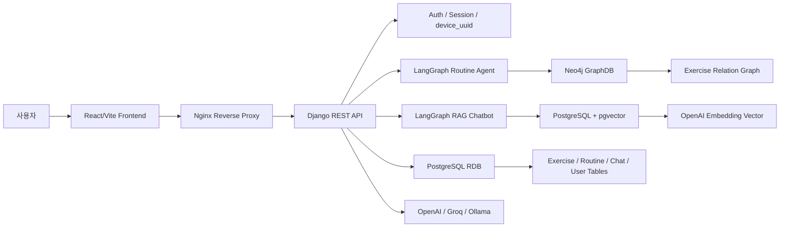
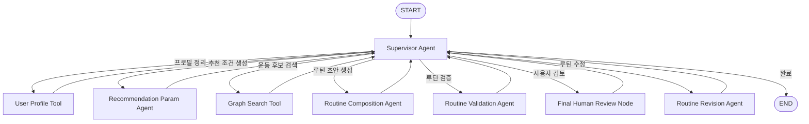
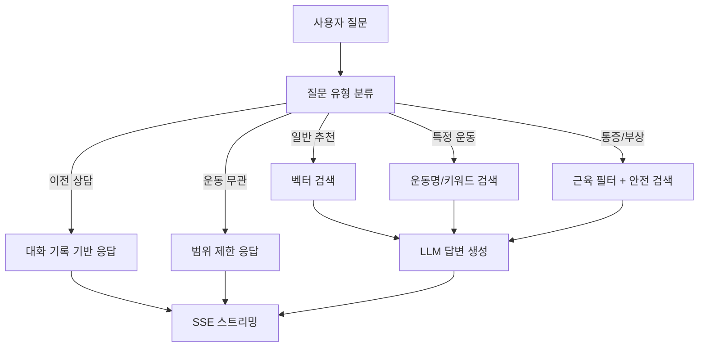

# 시스템 아키텍처

HELBOTIN은 React/Vite 프론트엔드, Django REST API, PostgreSQL + pgvector, Neo4j, LangGraph 기반 AI 워크플로우로 구성됩니다.

## 전체 구조

## 구성 요소

| 영역 | 구성 |
| --- | --- |
| Frontend | React 18, Vite, React Router, Lucide React |
| Backend | Django 4.2, Django REST Framework |
| Auth | 세션/JWT 인증, 로그인 사용자와 게스트 device_uuid 지원 |
| Primary DB | PostgreSQL 16, pgvector |
| Graph DB | Neo4j, APOC |
| AI Workflow | LangGraph 기반 루틴 추천 그래프와 RAG 챗봇 그래프 |
| Streaming | Django `StreamingHttpResponse` 기반 SSE 스트리밍 |
| Deployment | AWS EC2, Docker Compose, Nginx, Certbot HTTPS |

## AI 루틴 추천 구조

| Agent / Tool | 역할 |
| --- | --- |
| Supervisor Agent | 추천 상태와 검증 결과를 보고 다음 노드를 결정 |
| User Profile Tool | 설문 데이터를 추천 가능한 사용자 프로필로 정규화 |
| Recommendation Param Agent | 목표, 장비, 통증, 시간 조건을 검색 파라미터로 변환 |
| Graph Search Tool | Neo4j 운동 그래프에서 조건에 맞는 후보 조회 |
| Routine Composition Agent | 후보 운동을 사용해 주간 루틴 초안 구성 |
| Routine Validation Agent | 누락 부위, 장비 조건, 통증 위험, 운동 개수 검증 |
| Routine Revision Agent | 사용자 피드백 또는 검증 실패를 반영해 루틴 수정 |

## RAG 챗봇 구조

## 관련 문서

- [AI 루틴 추천](../ai/routine-service.md)
- [RAG 프로젝트 정리](../rag/RAG_프로젝트_정리.md)
- [RAG 챗봇 기술명세](../rag/RAG_챗봇_기술명세.md)
- [ERD 및 GraphDB 요약](./erd_graphdb.md)
