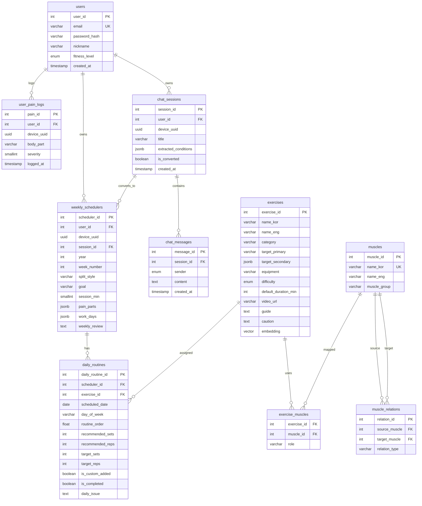
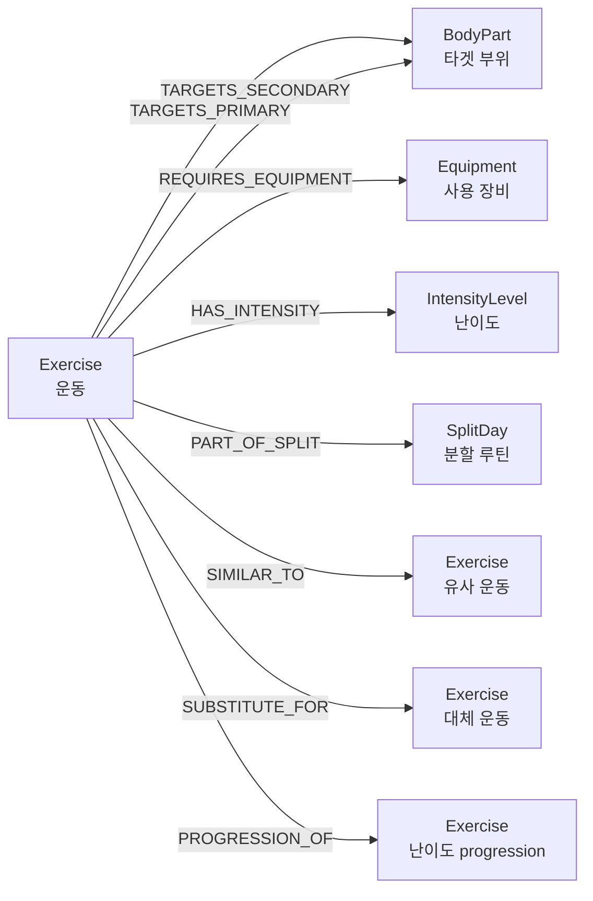

# ERD 및 그래프 데이터 모델

## PostgreSQL ERD

## Neo4j GraphDB

### 노드

| 노드 | 역할 |
| --- | --- |
| Exercise | 루틴 추천 대상 운동 |
| BodyPart | 주/보조 타겟 부위 |
| Equipment | 운동에 필요한 장비 |
| IntensityLevel | 초급/중급/고급 난이도 |
| SplitDay | 가슴, 등, 하체, 어깨, 팔 분할 |

### 관계

| 관계 | 의미 |
| --- | --- |
| `TARGETS_PRIMARY` | 운동의 주 타겟 부위 |
| `TARGETS_SECONDARY` | 운동의 보조 타겟 부위 |
| `REQUIRES_EQUIPMENT` | 운동 수행에 필요한 장비 |
| `HAS_INTENSITY` | 운동 난이도 |
| `PART_OF_SPLIT` | 5분할 루틴의 어느 요일/부위에 속하는지 |
| `SIMILAR_TO` | 유사한 자극 또는 동작을 가진 운동 |
| `SUBSTITUTE_FOR` | 통증, 장비, 장소 조건에 따라 대체 가능한 운동 |
| `PROGRESSION_OF` | 난이도나 숙련도 progression 관계 |
