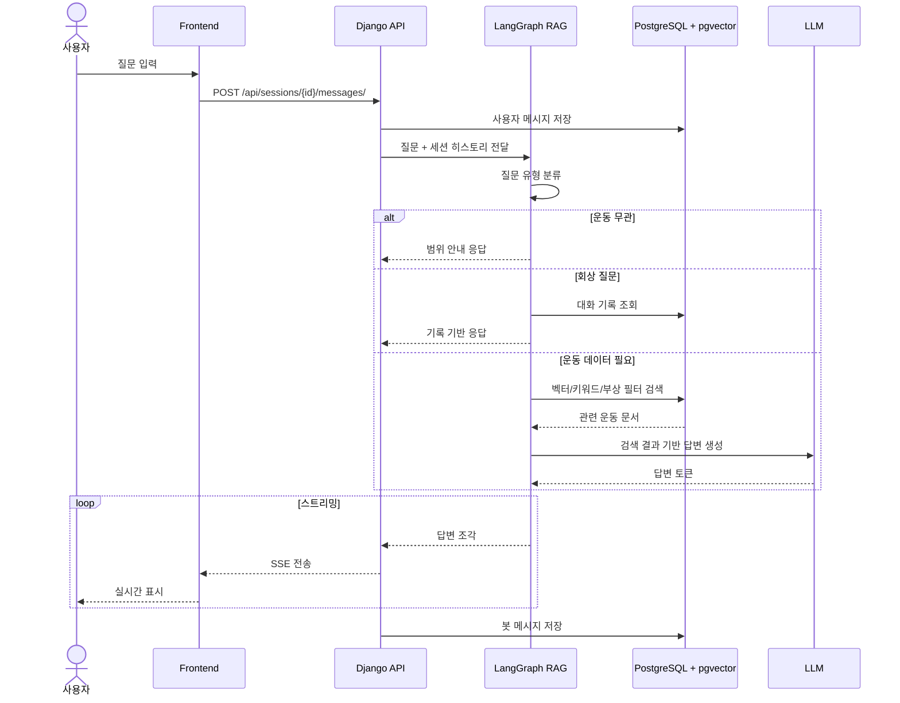
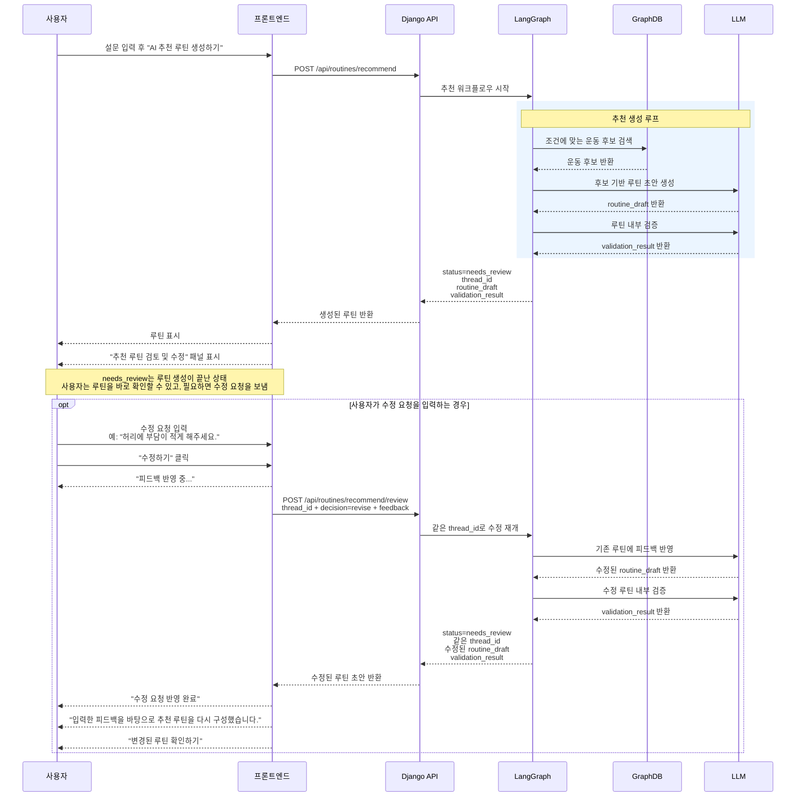

# 시퀀스 다이어그램

## AI 챗봇 RAG 시퀀스

```mermaid
sequenceDiagram
    actor User as 사용자
    participant FE as Frontend
    participant API as Django API
    participant Graph as LangGraph RAG
    participant DB as PostgreSQL + pgvector
    participant LLM as LLM

    User->>FE: 질문 입력
    FE->>API: POST /api/sessions/{id}/messages/
    API->>DB: 사용자 메시지 저장
    API->>Graph: 질문 + 세션 히스토리 전달
    Graph->>Graph: 질문 유형 분류

    alt 운동 무관
        Graph-->>API: 범위 안내 응답
    else 회상 질문
        Graph->>DB: 대화 기록 조회
        Graph-->>API: 기록 기반 응답
    else 운동 데이터 필요
        Graph->>DB: 벡터/키워드/부상 필터 검색
        DB-->>Graph: 관련 운동 문서
        Graph->>LLM: 검색 결과 기반 답변 생성
        LLM-->>Graph: 답변 토큰
    end

    loop 스트리밍
        Graph-->>API: 답변 조각
        API-->>FE: SSE 전송
        FE-->>User: 실시간 표시
    end

    API->>DB: 봇 메시지 저장
```

## 루틴 추천 및 피드백 시퀀스

```mermaid
%%{init: {
  "themeVariables": {
    "fontSize": "18px",
    "fontFamily": "Arial"
  }
}}%%

sequenceDiagram
    participant User as 사용자
    participant FE as 프론트엔드
    participant API as Django API
    participant Graph as LangGraph
    participant DB as GraphDB
    participant LLM as LLM

    User->>FE: 설문 입력 후 "AI 추천 루틴 생성하기"
    FE->>API: POST /api/routines/recommend
    API->>Graph: 추천 워크플로우 시작

    rect rgb(235, 245, 255)
        Note over Graph,LLM: 추천 생성 루프
        Graph->>DB: 조건에 맞는 운동 후보 검색
        DB-->>Graph: 운동 후보 반환
        Graph->>LLM: 후보 기반 루틴 초안 생성
        LLM-->>Graph: routine_draft 반환
        Graph->>LLM: 루틴 내부 검증
        LLM-->>Graph: validation_result 반환
    end

    Graph-->>API: status=needs_review<br/>thread_id<br/>routine_draft<br/>validation_result
    API-->>FE: 생성된 루틴 반환
    FE-->>User: 루틴 표시
    FE-->>User: "추천 루틴 검토 및 수정" 패널 표시

    Note over FE,User: needs_review는 루틴 생성이 끝난 상태<br/>사용자는 루틴을 바로 확인할 수 있고, 필요하면 수정 요청을 보냄

    opt 사용자가 수정 요청을 입력하는 경우
        User->>FE: 수정 요청 입력<br/>예: "허리에 부담이 적게 해주세요."
        User->>FE: "수정하기" 클릭
        FE-->>User: "피드백 반영 중..."
        FE->>API: POST /api/routines/recommend/review<br/>thread_id + decision=revise + feedback
        API->>Graph: 같은 thread_id로 수정 재개

        Graph->>LLM: 기존 루틴에 피드백 반영
        LLM-->>Graph: 수정된 routine_draft 반환
        Graph->>LLM: 수정 루틴 내부 검증
        LLM-->>Graph: validation_result 반환

        Graph-->>API: status=needs_review<br/>같은 thread_id<br/>수정된 routine_draft<br/>validation_result
        API-->>FE: 수정된 루틴 초안 반환
        FE-->>User: "수정 요청 반영 완료"
        FE-->>User: "입력한 피드백을 바탕으로 추천 루틴을 다시 구성했습니다."
        FE-->>User: "변경된 루틴 확인하기"
    end
```
