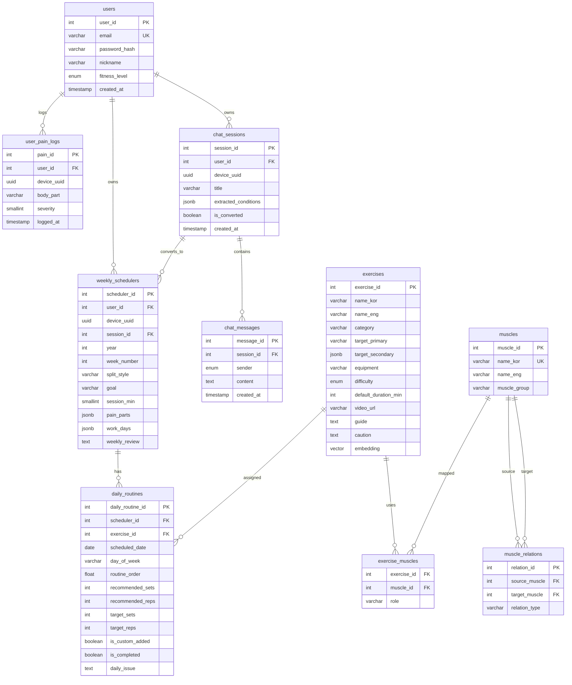
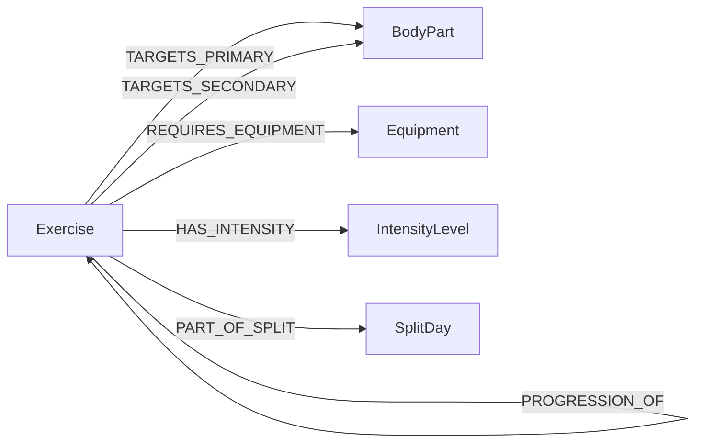

# ERD 및 그래프 데이터 모델

## PostgreSQL ERD

## Neo4j 그래프 스키마

| Label | 역할 |
| --- | --- |
| Exercise | 5분할 추천 대상 운동 |
| BodyPart | 주/보조 타겟 부위 |
| Equipment | 장비 필터 |
| IntensityLevel | 초급/중급/고급 난이도 |
| SplitDay | 가슴, 등, 하체, 어깨, 팔 분할 |

상세 그래프 명세는 [planfit_graphdb_spec.md](./planfit_graphdb_spec.md)를 참고합니다.
