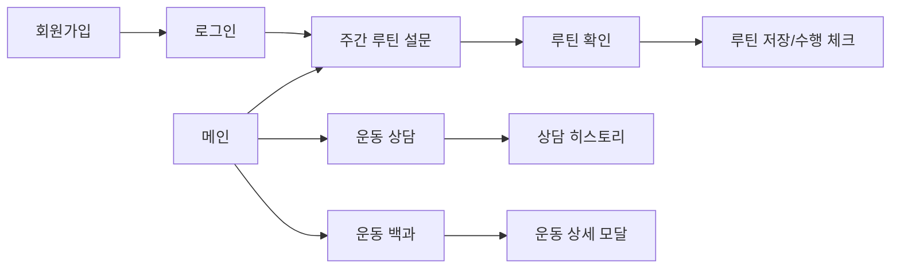
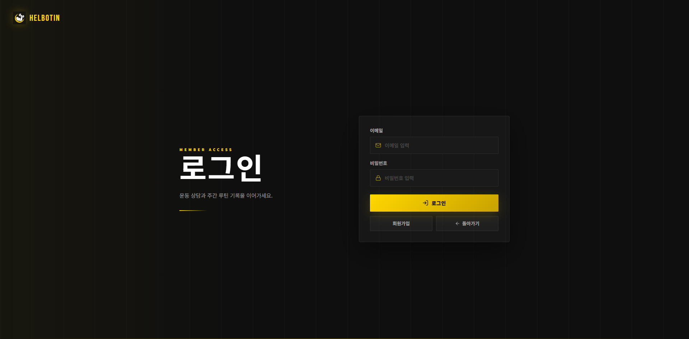
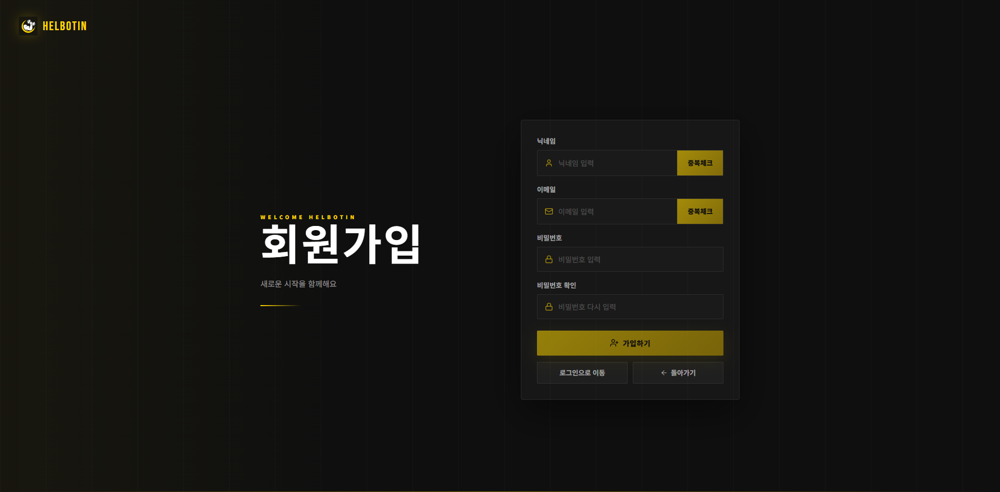
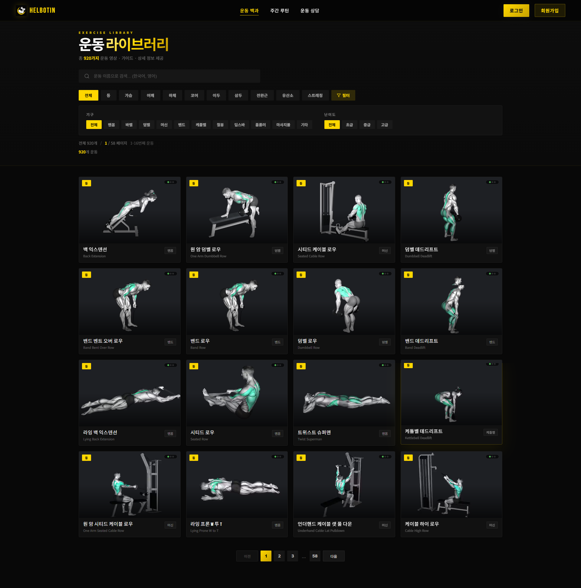
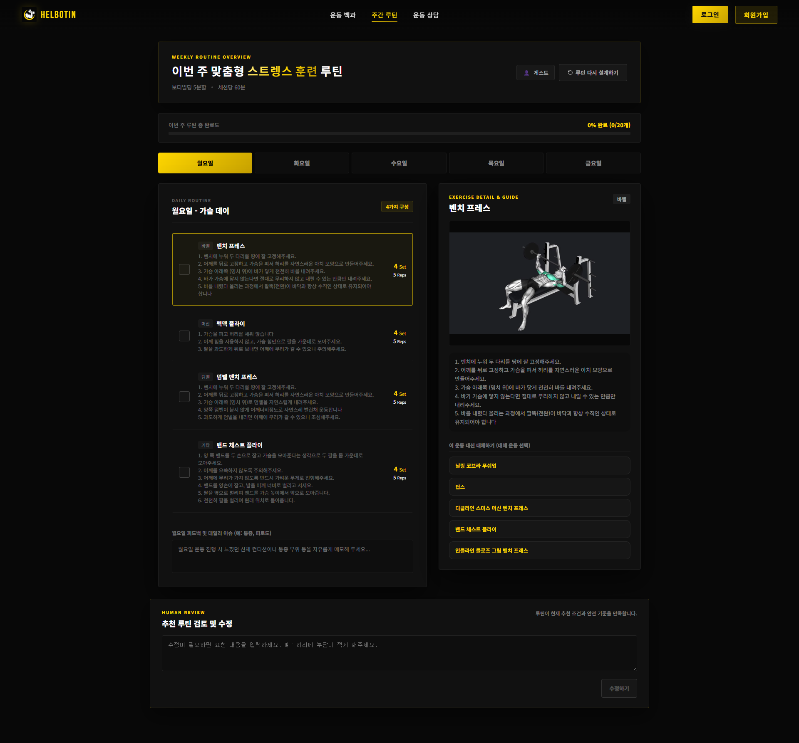
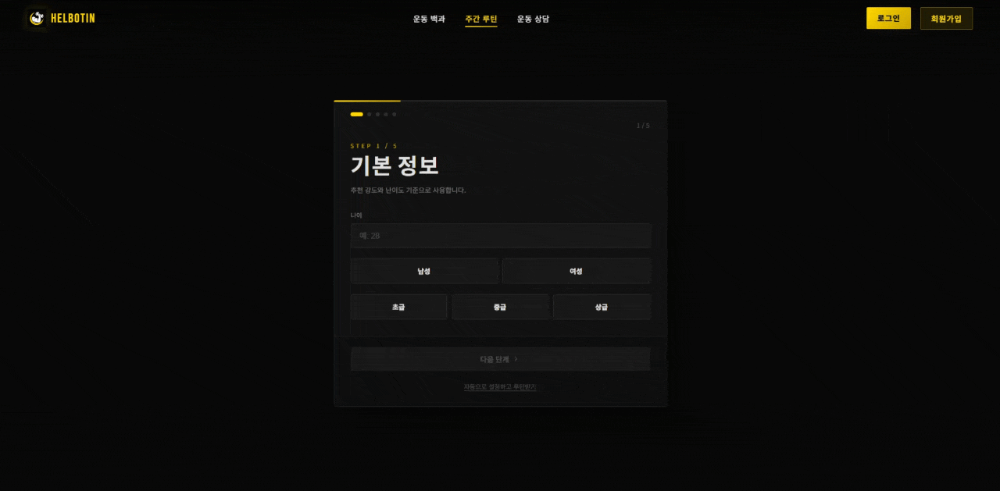
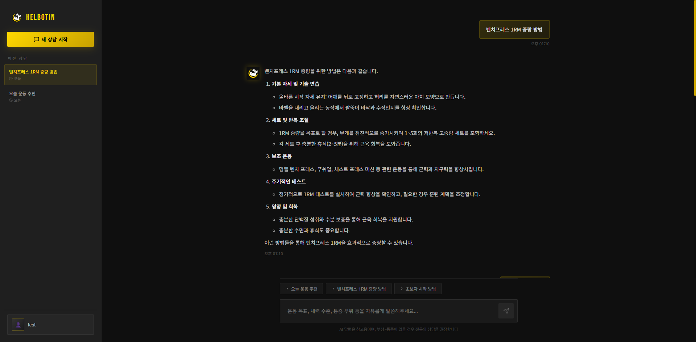

# 화면 설계

HELBOTIN의 화면은 사용자가 운동 정보를 탐색하고, AI 루틴을 추천받고, 운동 상담을 이어가는 흐름을 중심으로 설계했습니다.

## 화면 구성 요약

| 화면 | 주요 구성 | 사용자 액션 | 연결 API |
| --- | --- | --- | --- |
| 메인 | 서비스 소개, 루틴 추천 진입, 챗봇 진입, 운동 목록 미리보기 | 시작하기, 운동 상담, 전체 운동 보기 | `GET /api/exercises/featured/` |
| 운동 백과 | 카테고리/기구/난이도 필터, 검색, 운동 카드 | 필터링, 상세 보기, 영상 확인 | `GET /api/exercises/`, `GET /api/exercises/{id}/` |
| 운동 상세 모달 | 영상, 설명, 자세, 호흡, 주의사항, 관련 운동 | 관련 운동 이동, 모달 닫기 | `GET /api/exercises/{id}/` |
| 주간 루틴 설문 | 기본 정보, 통증 부위, 운동 요일, 목표, 시간 | 다음 단계, AI 추천 생성 | `POST /api/routines/recommend/` |
| 루틴 확인 | 요일별 루틴, 완료 체크, 대체 운동, 데일리 메모 | 저장, 대체 운동 선택, 다시 설계 | `GET/POST /api/routines/` |
| 운동 상담 | 세션 목록, 메시지, 스트리밍 답변 | 새 상담, 질문 입력, 세션 삭제/수정 | `GET/POST /api/sessions/`, `GET/POST /api/sessions/{id}/messages/` |
| 로그인 | 이메일, 비밀번호 | 로그인, 회원가입 이동 | `POST /api/auth/login/` |
| 회원가입 | 닉네임/이메일 중복 확인, 비밀번호 | 가입, 로그인 이동 | `POST /api/auth/register/` |

## 사용자 흐름

1. 사용자가 운동 목표, 체력 수준, 통증 부위, 운동 가능 요일을 입력합니다.
2. HELBOTIN이 조건에 맞는 주간 루틴을 추천합니다.
3. 사용자는 추천 루틴을 검토하고 필요한 경우 수정 요청을 남깁니다.
4. 확정된 루틴을 수행하며 완료 체크와 데일리 메모를 기록합니다.
5. 궁금한 운동은 AI 챗봇과 운동 라이브러리에서 바로 확인합니다.

## 주요 화면

### 로그인

사용자는 이메일과 비밀번호로 로그인하며, 로그인 후 루틴 저장과 상담 히스토리 관리 흐름을 이어갈 수 있습니다.

### 회원가입

회원가입 화면에서는 닉네임과 이메일 중복 확인을 거쳐 계정을 생성합니다. 이후 로그인 화면으로 이동해 서비스를 사용할 수 있습니다.

### 운동 백과

운동 백과는 운동 목록 탐색을 위한 화면입니다. 사용자는 카테고리, 장비, 난이도, 검색어를 기준으로 운동을 찾고 상세 모달에서 자세와 영상을 확인합니다.

### 주간 루틴 추천

주간 루틴 화면은 설문 입력, AI 추천 생성, 추천 결과 확인으로 이어집니다. 사용자는 목표, 운동 수준, 통증 부위, 운동 가능 요일과 시간을 입력하고 개인화된 루틴을 받을 수 있습니다.

### 루틴 추천 온보딩

루틴 추천 설문은 단계별 입력 방식으로 구성해 사용자가 한 번에 많은 정보를 입력하지 않도록 했습니다.

### 운동 상담

운동 상담 화면은 세션 목록과 채팅 영역으로 구성됩니다. 사용자는 운동 자세, 통증, 대체 운동, 루틴 관련 질문을 입력하고 SSE 스트리밍으로 답변을 확인합니다.

## 화면 설계 포인트

| 포인트 | 설명 |
| --- | --- |
| 탐색성 | 운동 백과에서 검색, 필터, 상세 모달을 통해 원하는 운동 정보를 빠르게 찾도록 구성 |
| 개인화 | 루틴 설문에서 목표, 수준, 통증, 요일, 시간을 단계적으로 수집 |
| 피드백 | 추천 루틴 확인 후 수정 요청과 다시 설계를 통해 사용자가 결과를 조정 가능 |
| 지속성 | 로그인 사용자와 게스트 사용자를 구분하고, 루틴/상담 기록을 이어갈 수 있도록 구성 |
| 안전성 | 통증 부위와 주의사항을 루틴 추천 및 챗봇 답변 흐름에 반영 |
